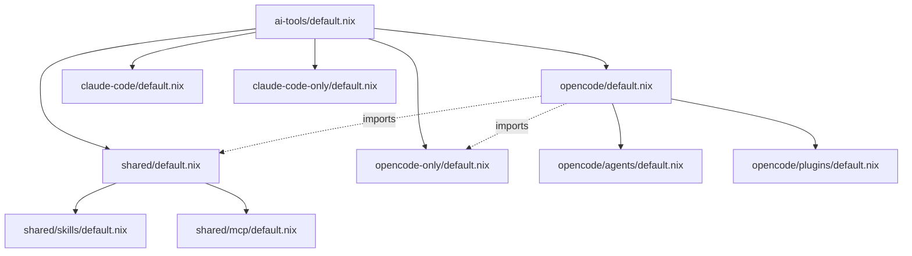

# AI Tools Module Architecture

This module organizes configuration for AI-assisted coding tools (OpenCode, Claude Code) and their shared resources (skills, MCP servers, instructions).

## Module Hierarchy

The structure follows a layered approach to maximize reuse while allowing tool-specific overrides.

```text
ai-tools/
├── default.nix             # Root entry point, imports all categories
├── shared/                 # Resources shared by ALL AI tools
│   ├── default.nix         # Imports skills and mcp
│   ├── skills/             # Tool/Skill definitions
│   ├── mcp/                # MCP server configurations
│   └── instructions/       # Shared markdown system prompts
├── opencode/               # OpenCode-specific configuration
│   ├── default.nix         # Main OpenCode config, imports shared/opencode-only
│   ├── agents/             # Custom OpenCode agent instructions
│   └── plugins/            # OpenCode-specific plugins (e.g., oh-my-opencode)
├── claude-code/            # Claude Code-specific configuration
│   └── default.nix         # Main Claude Code config
├── opencode-only/          # Resources for OpenCode (not shared with Claude)
│   ├── default.nix
│   ├── skills/             # Skills only compatible with OpenCode
│   └── instructions/       # Instructions specifically for OpenCode
└── claude-code-only/        # Resources for Claude Code (not shared with OpenCode)
    ├── default.nix
    └── ...
```

## Import Relationships

### Visual Overview



## Import Conventions

To maintain a clean and predictable structure, follow these path conventions:

### 1. Parent to Child (Downwards)
Use relative paths starting with `./`. This is the standard for importing sub-modules or local files.
```nix
# modules/home-manager/features/ai-tools/default.nix
imports = [
  ./shared
  ./opencode
];
```

### 2. Child to Sibling (Sideways)
Use `../` to ascend to the parent directory and then descend into the sibling. This is common when tool-specific modules import shared resources.
```nix
# modules/home-manager/features/ai-tools/opencode/default.nix
imports = [
  ../shared         # Access shared resources
  ../opencode-only  # Access opencode-exclusive resources
];
```

### 3. Referencing Assets (Markdown/Scripts)
When referencing files (like markdown instructions) that are not Nix modules, use string interpolation with the relative path. This ensures the files are correctly added to the Nix store.
```nix
# modules/home-manager/features/ai-tools/opencode/default.nix
settings.instructions = [
  "${../shared/instructions/nix-environment.md}"
];
```

## Examples

### Adding a Shared Skill
1. Place the skill definition in `shared/skills/`.
2. Add it to `shared/skills/default.nix`.
3. It will automatically be available to both OpenCode and Claude Code if they import `../shared`.

### Adding an OpenCode-Only Plugin
1. Place the plugin configuration in `opencode/plugins/`.
2. Import it in `opencode/plugins/default.nix`.
3. Since it's inside the `opencode/` directory, it remains isolated from other tools.

### Overriding Shared Logic
If a tool needs a variation of shared logic, place the tool-specific version in its own directory (e.g., `opencode-only/`) and import it in the tool's main config (`opencode/default.nix`).
