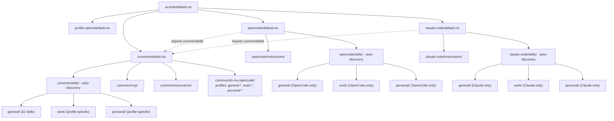

# AI Tools Module Architecture

This module organizes configuration for AI-assisted coding tools (OpenCode, Claude Code) and their shared resources (skills, MCP servers, instructions) using a **profile-based architecture** that supports multiple environments (work, personal).

## Module Hierarchy

The structure follows a layered approach to maximize reuse while allowing tool-specific and profile-specific overrides.

```text
ai-tools/
├── default.nix             # Root entry point, imports all categories
├── profile-option/         # Profile configuration module
│   └── default.nix         # Defines myHomeManager.aiProfile option (work|personal)
├── common/                 # Resources shared by ALL AI tools and profiles
│   ├── default.nix         # Exports skills and mcp
│   ├── skills/             # Shared skills with directory-based auto-discovery
│   │   ├── default.nix     # Auto-discovery logic, exports commonSkills
│   │   ├── general/        # Skills available to all profiles (32 skills)
│   │   ├── work/           # Skills only for work profile
│   │   └── personal/       # Skills only for personal profile
│   ├── mcp/                # MCP server configurations
│   ├── instructions/       # Shared markdown system prompts (nix-environment.md)
│   └── oh-my-opencode/     # oh-my-opencode configuration files
│       ├── general-oh-my-opencode-gemini.jsonc    # Shared config
│       ├── work-oh-my-opencode.jsonc             # Work profile config
│       └── personal-oh-my-opencode.jsonc         # Personal profile config
├── opencode/               # OpenCode-specific configuration
│   ├── default.nix         # Main OpenCode config with profile-based filtering
│   ├── skills/             # OpenCode-only skills with directory-based auto-discovery
│   │   ├── default.nix     # Auto-discovery logic
│   │   ├── general/        # OpenCode-only skills for all profiles
│   │   ├── work/           # OpenCode-only work profile skills
│   │   └── personal/       # OpenCode-only personal profile skills
│   ├── instructions/       # OpenCode-specific markdown (shell-strategy.md)
│   ├── agents/             # Custom OpenCode agent instructions
│   ├── formatters.nix      # Formatter configurations
│   ├── permission.nix      # Permission settings
│   ├── provider.nix        # Provider settings
│   ├── lsp.nix             # LSP settings
│   ├── plugins/            # OpenCode-specific plugins (oh-my-opencode routing)
│   └── plugins/oh-my-opencode/default.nix
└── claude-code/            # Claude Code-specific configuration
    ├── default.nix         # Main Claude Code config with Nix-time filtering
    ├── skills/             # Claude Code-only skills with directory-based auto-discovery
    │   ├── default.nix     # Auto-discovery logic, exports claudeCodeLocalSkills
    │   ├── general/        # Claude Code-only skills for all profiles
    │   ├── work/           # Claude Code-only work profile skills
    │   └── personal/       # Claude Code-only personal profile skills
    ├── instructions/       # (Subdirectory for future use)
    └── agents/             # (Subdirectory for future use)
```

## Import Relationships

### Visual Overview



### Architecture Overview

**Profile-Based Organization**:
- The `profile-option/` module defines `myHomeManager.aiProfile` (enum: "work" | "personal")
- Each host sets its profile: `hosts/mac-m1-max/home.nix` → `aiProfile = "work"`, `hosts/framework-16/home.nix` → `aiProfile = "personal"`
- Resources are prefixed to indicate scope: `general-*`, `work-*`, `personal-*`

**Tool-Specific Filtering**:
- **OpenCode**: Uses runtime filtering with wildcard `permission.skill` patterns (e.g., `"work-*" = "allow"`)
- **Claude Code**: Uses Nix-time filtering with `lib.filterAttrs` and `lib.hasPrefix` to include/exclude skills at configuration time

**Shared Resources**:
- `common/` directory contains resources available to all profiles and tools
- 32 general-prefixed skills provide universal functionality via auto-discovery
- oh-my-opencode configurations in `common/oh-my-opencode/` support all profiles

**Skill Auto-Discovery**:
- All skill directories (`common/skills/`, `opencode/skills/`, `claude-code/skills/`) use directory-based auto-discovery
- Skills are organized into `general/`, `work/`, `personal/` subdirectories
- Directory names become skill IDs with their prefix (e.g., `general/jq/` → `general-jq`)
- Prefix directories with `disabled-` to skip them (e.g., `disabled-my-skill/`)

## Import Conventions

To maintain a clean and predictable structure, follow these path conventions:

### 1. Parent to Child (Downwards)
Use relative paths starting with `./`. This is the standard for importing sub-modules or local files.
```nix
# modules/home-manager/features/ai-tools/default.nix
imports = [
  ./profile-option
  ./common
  ./opencode
  ./claude-code
];
```

### 2. Child to Sibling (Sideways)
Use `../` to ascend to the parent directory and then descend into the sibling. This is common when tool-specific modules import shared resources.
```nix
# modules/home-manager/features/ai-tools/opencode/default.nix
imports = [
  ../common           # Access shared resources
  ./plugins          # Local tool-specific plugins
];
```

### 3. Referencing Assets (Markdown/Scripts)
When referencing files (like markdown instructions) that are not Nix modules, use string interpolation with the relative path. This ensures the files are correctly added to the Nix store.
```nix
# modules/home-manager/features/ai-tools/opencode/default.nix
settings.instructions = [
  "${./instructions/shell-strategy.md}"
  "${../common/instructions/nix-environment.md}"
];
```

## Naming Conventions

### Skill and File Prefixes
Resources follow a consistent prefix pattern to indicate their scope:

- **`general-*`**: Available to all profiles and tools (e.g., `general-agent-browser`, `general-nix`, `general-typescript`)
- **`work-*`**: Available only when `aiProfile = "work"` (reserved for future profile-specific skills)
- **`personal-*`**: Available only when `aiProfile = "personal"` (reserved for future profile-specific skills)

### Configuration Files
oh-my-opencode configurations follow the pattern `<profile>-oh-my-opencode<-variant>.jsonc`:

```
general/oh-my-opencode/
├── general-oh-my-opencode-gemini.jsonc      # Shared config variant
├── work-oh-my-opencode.jsonc                # Work profile config
└── personal-oh-my-opencode.jsonc            # Personal profile config
```

## Profile-Based Filtering

### OpenCode (Runtime Filtering)
OpenCode uses wildcard patterns in `settings.permission.skill` for runtime filtering:

```nix
# All profiles always get general-* skills
permission.skill = {
  "general-*" = "allow";
}
# Work profile additionally gets work-* skills
// lib.optionalAttrs aiProfileHelpers.isWork {
  "work-*" = "allow";
}
// lib.optionalAttrs aiProfileHelpers.isPersonal {
  "personal-*" = "allow";
};
```

**How it works**: At runtime, OpenCode checks each skill name against these patterns and allows/denies access accordingly.

### Claude Code (Nix-time Filtering)
Claude Code uses `lib.filterAttrs` and `lib.hasPrefix` for filtering at configuration evaluation time:

```nix
let
  allSkills = (import ../common/skills {inherit pkgs lib;}).programs.claude-code.skills;
  
  filteredSkills = lib.filterAttrs (name: _:
    lib.hasPrefix "general-" name
    || (aiProfileHelpers.isWork && lib.hasPrefix "work-" name)
    || (aiProfileHelpers.isPersonal && lib.hasPrefix "personal-" name)
  ) allSkills;
in {
  programs.claude-code.skills = filteredSkills;
}
```

**How it works**: The skills attribute set is evaluated at Nix time, producing a final configuration that only includes the appropriate skills. This happens once during `nix flake check` or build, not at runtime.

## Adding Resources by Profile

All skill directories use **directory-based auto-discovery**. Simply create a directory with a `SKILL.md` file, and it will be automatically discovered and registered.

### Adding a New General Skill (shared by both tools)
1. Create a new directory in `common/skills/general/<skill-name>/` (e.g., `common/skills/general/my-tool/`)
2. Add a `SKILL.md` file with frontmatter (name, description, allowed-tools) and content
3. Optionally add `templates/` and `references/` subdirectories
4. The skill will be auto-discovered as `general-my-tool` and available to both OpenCode and Claude Code

**To disable a skill**: Rename the directory with `disabled-` prefix (e.g., `disabled-my-tool/`)

### Adding a Work-Specific Skill (shared by both tools)
1. Create a new directory in `common/skills/work/<skill-name>/`
2. Add `SKILL.md` and optional subdirectories
3. The skill will be auto-discovered as `work-<skill-name>`
4. Only available when `aiProfile = "work"`

### Adding a Personal-Specific Skill (shared by both tools)
1. Create a new directory in `common/skills/personal/<skill-name>/`
2. Add `SKILL.md` and optional subdirectories
3. The skill will be auto-discovered as `personal-<skill-name>`
4. Only available when `aiProfile = "personal"`

### Adding a Claude Code-Only Skill
1. Create a new directory in `claude-code/skills/` under the appropriate profile subdirectory:
   - `claude-code/skills/general/<skill-name>/` - Available on all profiles
   - `claude-code/skills/work/<skill-name>/` - Only when `aiProfile = "work"`
   - `claude-code/skills/personal/<skill-name>/` - Only when `aiProfile = "personal"`
2. Add `SKILL.md` file with frontmatter and content
3. The skill will be auto-discovered with its prefix (e.g., `general-my-skill`)
4. Only available to Claude Code, not OpenCode

### Adding an OpenCode-Only Skill
1. Create a new directory in `opencode/skills/` under the appropriate profile subdirectory:
   - `opencode/skills/general/<skill-name>/` - Available on all profiles
   - `opencode/skills/work/<skill-name>/` - Only when `aiProfile = "work"`
   - `opencode/skills/personal/<skill-name>/` - Only when `aiProfile = "personal"`
2. Add `SKILL.md` file with frontmatter and content
3. The skill will be auto-discovered with its prefix (e.g., `general-my-skill`)
4. Only available to OpenCode, not Claude Code

### Skill Directory Structure
```
<skill-name>/
├── SKILL.md              # Required: Frontmatter (name, description, allowed-tools) + content
├── templates/            # Optional: Code templates
└── references/           # Optional: Reference documentation
```

Example `SKILL.md`:
```markdown
---
name: my-skill
description: Does something useful
allowed-tools: Bash(my-skill:*)
---

# My Skill

Instructions and documentation...
```

### Adding a Tool-Specific Instruction
- For **shared instructions** (both tools): Place in `common/instructions/`
- For **OpenCode only**: Place in `opencode/instructions/`
- For **Claude Code only**: Place in `claude-code/instructions/` (not yet used)

### Managing oh-my-opencode Configurations
- **General (Shared)**: `common/oh-my-opencode/general-oh-my-opencode-gemini.jsonc`
- **Work profile**: `common/oh-my-opencode/work-oh-my-opencode.jsonc` (routed by host: mac-m1-max)
- **Personal profile**: `common/oh-my-opencode/personal-oh-my-opencode.jsonc` (routed by host: framework-16)

The `opencode/plugins/oh-my-opencode/default.nix` module implements the routing logic based on `currentSystemName`.
