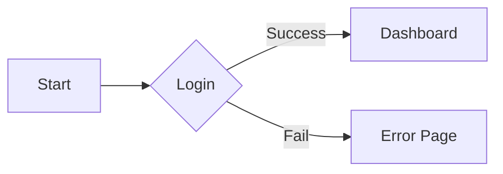
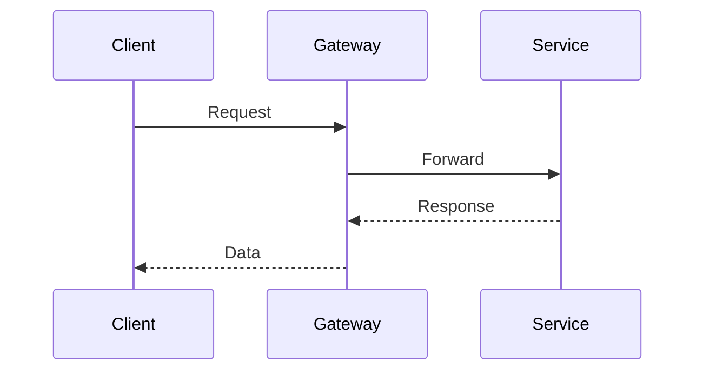
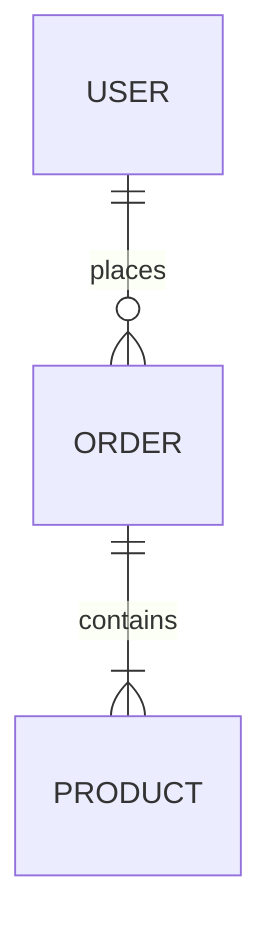
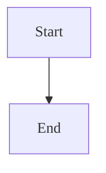

# Accessibility in Mermaid Diagrams

## Table of Contents
- [Overview](#overview)
- [accTitle Syntax](#acctitle-syntax)
- [accDescr Syntax](#accdescr-syntax)
- [Diagram Examples](#diagram-examples)
  - [Flowchart](#flowchart)
  - [Sequence Diagram](#sequence-diagram)
  - [Entity Relationship Diagram (ERD)](#entity-relationship-diagram-erd)
- [GitLab Production Pattern](#gitlab-production-pattern)
- [Validation Checklist](#validation-checklist)

## Overview
Apply `accTitle` and `accDescr` to ensure Mermaid diagrams are accessible to users of screen readers and other assistive technologies. These attributes are essential for WCAG compliance and provide text alternatives for visual content.

## accTitle Syntax
Define a short, descriptive title to identify the diagram.

### Single-line
Use for concise titles:
`accTitle: Short title`

### Multi-line
Use curly braces for longer titles:
```mermaid
accTitle {
  Title spanning
  multiple lines
}
```

## accDescr Syntax
Define a comprehensive description that explains the diagram's structure and the information it conveys.

### Single-line
Use for simple descriptions:
`accDescr: Description text`

### Multi-line
Use curly braces for detailed explanations:
```mermaid
accDescr {
  Detailed description of the process,
  relationships, or logic shown
  in the diagram.
}
```

## Diagram Examples

### Flowchart
Place accessibility attributes immediately after the flowchart direction.


### Sequence Diagram
Add accessibility attributes at the beginning of the sequence diagram definition.


### Entity Relationship Diagram (ERD)
Apply accessibility attributes to describe the data model.


## GitLab Production Pattern
Incorporate the `init` directive with accessibility attributes for standard production styling.


## Validation Checklist
- [ ] Verify `accTitle` is present and descriptive.
- [ ] Ensure `accDescr` explains the diagram's purpose and key information.
- [ ] Confirm all labels are screen-reader friendly and avoid ambiguous icons.
- [ ] Check that accessibility attributes are placed at the top of the diagram definition.
