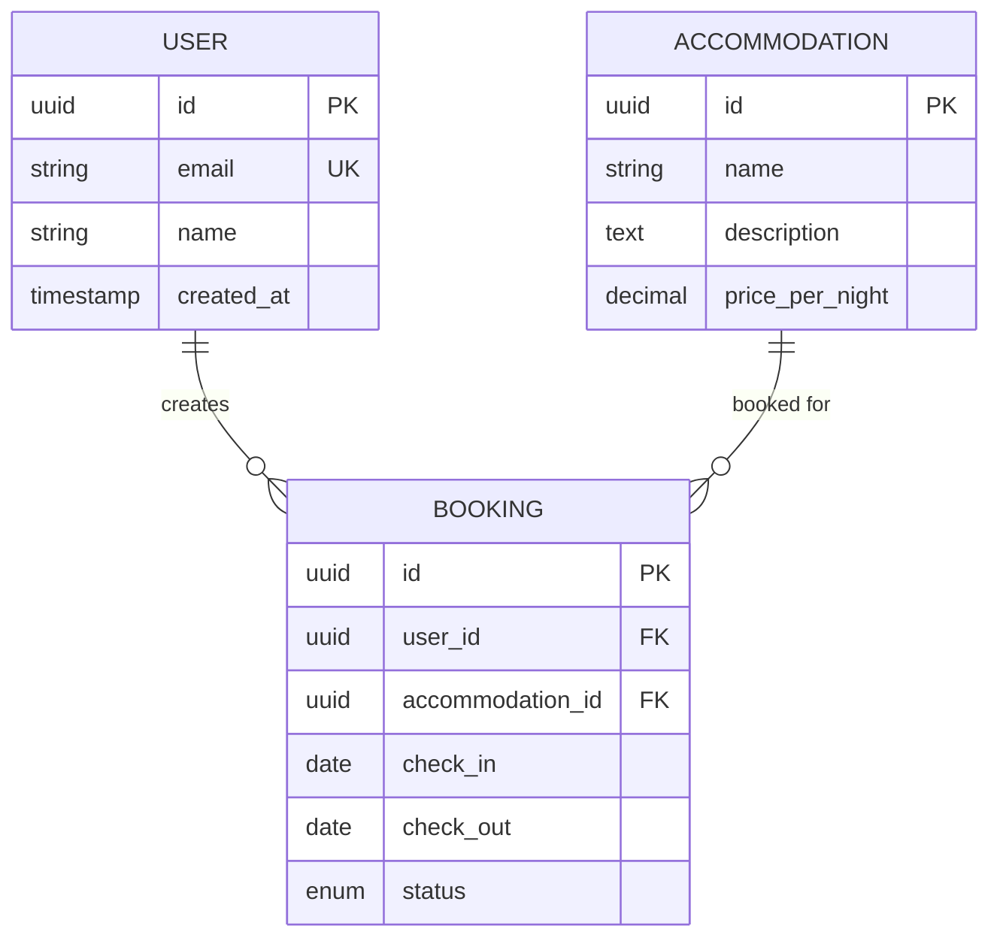
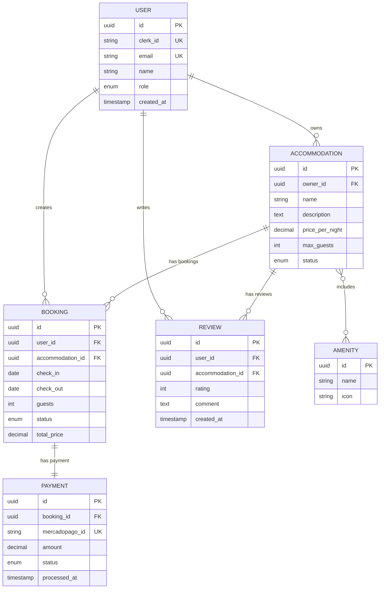
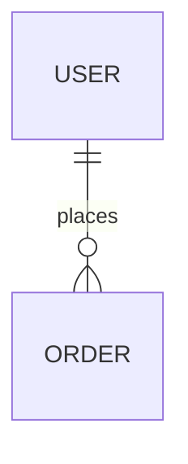

# Entity Relationship Diagrams Reference

## Table of Contents
- [Overview](#overview)
- [Syntax Overview](#syntax-overview)
- [Relationship Types](#relationship-types)
- [Cardinality Symbols](#cardinality-symbols)
- [Example](#example)
- [Accessibility](#accessibility)
- [Validation Checklist](#validation-checklist)

## Overview
ER diagrams model data structures and relationships between entities.

## Syntax Overview
Syntax:

## Relationship Types
- `||--||` - One to one
- `||--o{` - One to many
- `}o--o{` - Many to many
- `||--o|` - One to zero or one

## Cardinality Symbols
- `||` - Exactly one
- `o|` - Zero or one
- `}o` - Zero or more
- `}|` - One or more

## Example - Full Hospeda ERD:

## Accessibility

For full accessibility patterns, see [accessibility.md](accessibility.md).

Example:

## Validation Checklist
- [ ] All entities defined
- [ ] Relationships accurate
- [ ] Cardinality correct
- [ ] Primary/Foreign keys marked
- [ ] Accessibility attributes present
