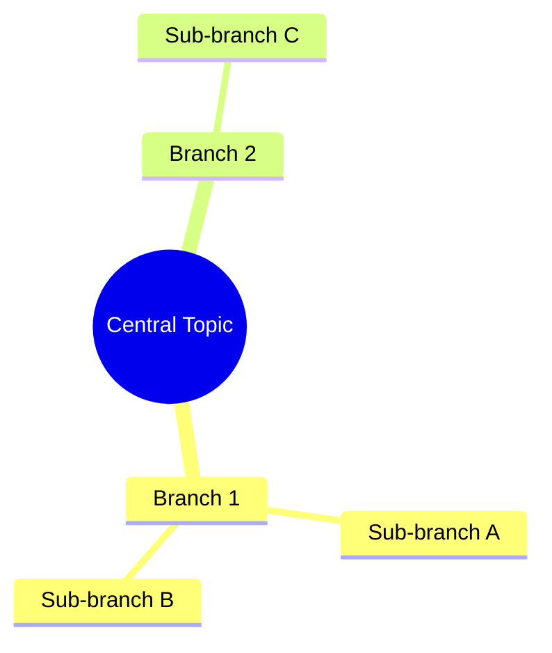
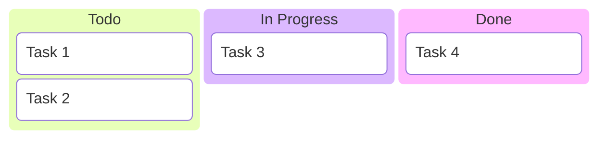
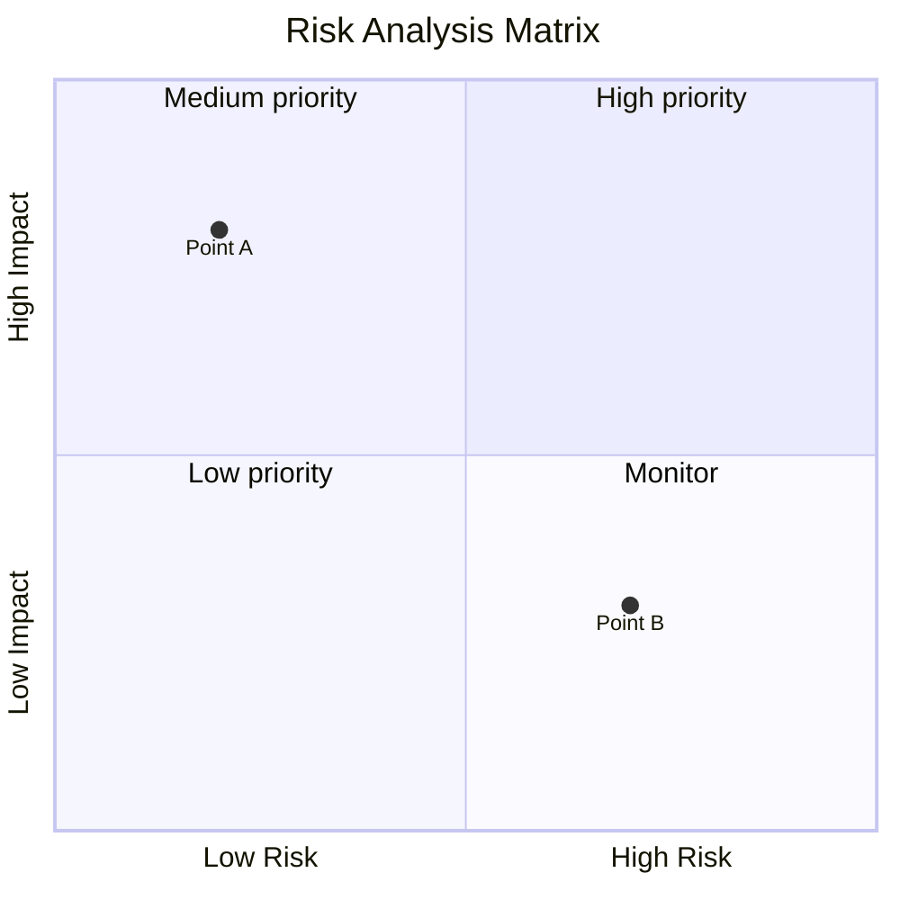
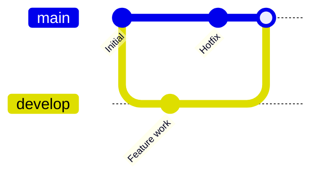
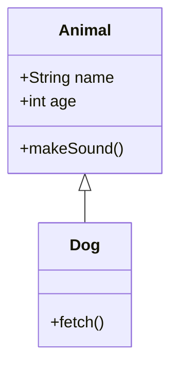
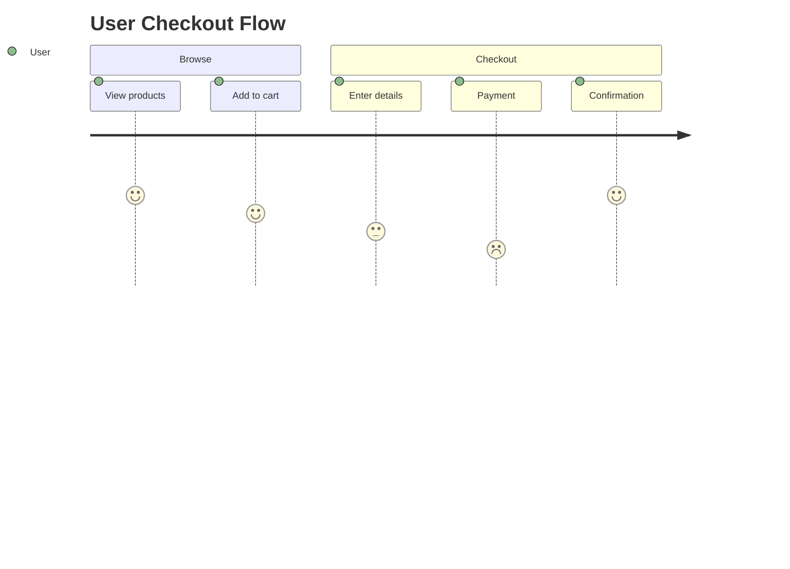
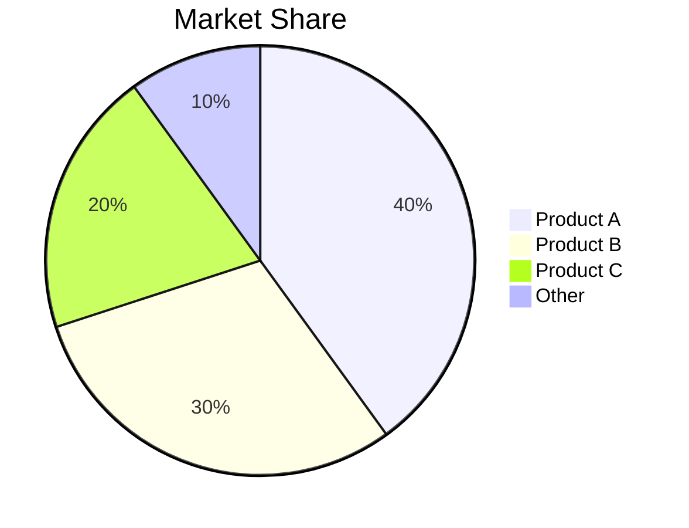

# Stable Mermaid Diagram Types

This reference documents stable, production-ready Mermaid diagram types that extend beyond standard flowcharts and sequence diagrams.

## Table of Contents
- [Mindmap](#mindmap)
- [Kanban](#kanban)
- [Quadrant Chart](#quadrant-chart)
- [Git Graph](#git-graph)
- [Class Diagram](#class-diagram)
- [User Journey](#user-journey)
- [Pie Chart](#pie-chart)

---

## Mindmap

### Overview
A Mindmap is a diagram used to visually organize information into a hierarchy, showing relationships among pieces of the whole.

### Syntax Overview

### Key Syntax Elements
- `mindmap`: Root keyword to start the diagram.
- `root((Text))`: Defines the central node (double parentheses create a circle).
- `Indentation`: Used to define the hierarchy and levels of branches.
- `Shape Syntax`:
    - `((Circle))`
    - `(Rounded Square)`
    - `[Square]`
    - `))Bang((`
    - `{{Cloud}}`

### Validation Checklist
- [ ] Diagram starts with the `mindmap` keyword.
- [ ] Hierarchy is correctly represented by consistent indentation.
- [ ] Only one root element is defined.

---

## Kanban

### Overview
Kanban diagrams provide a visual way to manage work as it moves through various stages of a process.

### Syntax Overview

### Key Syntax Elements
- `kanban`: Root keyword (Stable since v11.4).
- `column[Title]`: Defines a new vertical column.
- `task[Description]`: Defines a task within the preceding column.
- `Indentation`: Critical for nesting tasks under the correct columns.

### Validation Checklist
- [ ] Diagram starts with the `kanban` keyword.
- [ ] Columns have unique IDs or clear labels.
- [ ] Tasks are properly indented under their respective columns.

---

## Quadrant Chart

### Overview
A Quadrant Chart is a tool used to plot data points on a two-dimensional grid divided into four sections based on X and Y axes.

### Syntax Overview

### Key Syntax Elements
- `quadrantChart`: Root keyword.
- `title`: Optional chart title.
- `x-axis` / `y-axis`: Defines labels for the left/bottom and right/top of the axes.
- `quadrant-1` to `quadrant-4`: Labels for the four quadrants.
- `Point Name: [x, y]`: Plots a point where values are between 0 and 1.

### Validation Checklist
- [ ] Axis labels are defined using the `label1 --> label2` syntax.
- [ ] Point coordinates are floating point numbers between 0 and 1.
- [ ] Quadrant labels are assigned correctly to their numeric identifiers.

---

## Git Graph

### Overview
Git Graph is a specialized diagram for visualizing git branching, commits, and merge history.

### Syntax Overview

### Key Syntax Elements
- `gitGraph`: Root keyword.
- `commit`: Creates a new commit on the current branch.
- `branch [name]`: Creates a new branch.
- `checkout [name]`: Switches the active branch.
- `merge [name]`: Merges a branch into the current active branch.
- `cherry-pick id: [id]`: Applies a specific commit to the current branch.

### Validation Checklist
- [ ] Commands follow a logical git workflow (e.g., checkout before commit).
- [ ] Branch names are unique.
- [ ] Merges reference existing branches.

---

## Class Diagram

### Overview
Class Diagrams describe the structure of a system by showing its classes, attributes, operations, and the relationships among objects.

### Syntax Overview

### Key Syntax Elements
- `classDiagram`: Root keyword.
- `class Name { ... }`: Defines a class with its members.
- `Visibility`: `+` (Public), `-` (Private), `#` (Protected), `~` (Package).
- `Relationships`:
    - `<|--` (Inheritance)
    - `*--` (Composition)
    - `o--` (Aggregation)
    - `-->` (Association)
    - `..>` (Dependency)

### Validation Checklist
- [ ] Relationships use the correct arrow direction and style.
- [ ] Class members are grouped within curly braces or defined separately.
- [ ] Multiplicity (if used) is correctly quoted (e.g., `"1" *-- "many"`).

---

## User Journey

### Overview
User Journey diagrams describe the steps a user takes to complete a goal and their emotional state at each stage.

### Syntax Overview

### Key Syntax Elements
- `journey`: Root keyword.
- `title`: Title of the journey.
- `section`: Groups related steps together.
- `Task Name: Score: Roles`: Defines a step with an emotion score (1-5) and assigned roles.

### Validation Checklist
- [ ] Emotional scores are integers between 1 and 5.
- [ ] Sections are used to organize the flow chronologically.
- [ ] Multiple roles (if any) are comma-separated.

---

## Pie Chart

### Overview
A Pie Chart is a circular statistical graphic divided into slices to illustrate numerical proportion.

### Syntax Overview

### Key Syntax Elements
- `pie`: Root keyword.
- `title`: Optional title for the chart.
- `showData`: Optional keyword to display values next to labels.
- `"Label" : value`: Defines a slice and its numeric value.

### Validation Checklist
- [ ] Labels are enclosed in double quotes.
- [ ] Values are numeric.
- [ ] Total percentages do not necessarily need to sum to 100 (Mermaid calculates proportions).
