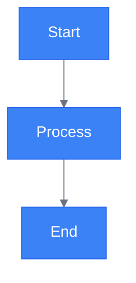
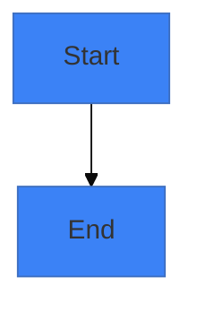
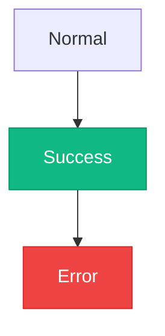

# Mermaid Styling Reference

## Table of Contents
- [Overview](#overview)
- [Theme Application](#theme-application)
- [Init Directives](#init-directives)
- [Class Styling](#class-styling)
- [Validation Checklist](#validation-checklist)

## Overview
This section covers applying consistent styling to diagrams for branding and readability.

## Theme Application


## Init Directives

Init directives allow per-diagram theming customization. Two approaches exist:

### Deprecated Syntax (v10.5.0+)

**⚠️ DEPRECATED**: The old `%%{init: {...}}%%` directive syntax is deprecated in Mermaid v10.5.0+. Use frontmatter config blocks instead.



### Modern Approach: Frontmatter Config Blocks

Prefer this syntax in Mermaid v10.5.0+:


### Common themeVariables

| Variable | Purpose | Example |
|----------|---------|---------|
| `primaryColor` | Main node/shape background | `#3B82F6` |
| `primaryTextColor` | Text color in primary elements | `#ffffff` |
| `primaryBorderColor` | Border color for primary shapes | `#2563EB` |
| `secondaryColor` | Secondary node/shape background | `#10B981` |
| `tertiaryColor` | Tertiary accent color | `#F59E0B` |
| `lineColor` | Edge/connector color | `#6B7280` |
| `fontFamily` | Custom font family | `'GitLab Sans', sans-serif` |

### GitLab-Style Example with Custom Font

```mermaid
---
config:
    theme: base
    themeVariables:
        primaryColor: '#0066cc'
        primaryTextColor: '#ffffff'
        primaryBorderColor: '#003399'
        lineColor: '#404040'
        secondaryColor: '#e1e8ed'
        tertiaryColor: '#ffd699'
        fontFamily: 'GitLab Sans', -apple-system, BlinkMacSystemFont, 'Segoe UI', Roboto, sans-serif
---
flowchart LR
    A["Deploy"] --> B["Test"]
    B --> C["Release"]
    
    classDef primary fill:#0066cc,stroke:#003399,color:#fff
    class A,C primary
```

### Migration Note
If updating diagrams from the old `%%{init: ...}%%` syntax:
1. Remove the `%%{init: ...}%%` line from the top
2. Replace with frontmatter config block (YAML between `---` markers)
3. Convert inline config objects to YAML structure
4. Update themeVariable keys to match the table above

## Class Styling


## Validation Checklist
- [ ] Colors match brand
- [ ] Contrast sufficient
- [ ] Styling consistent
- [ ] Readable in both themes
