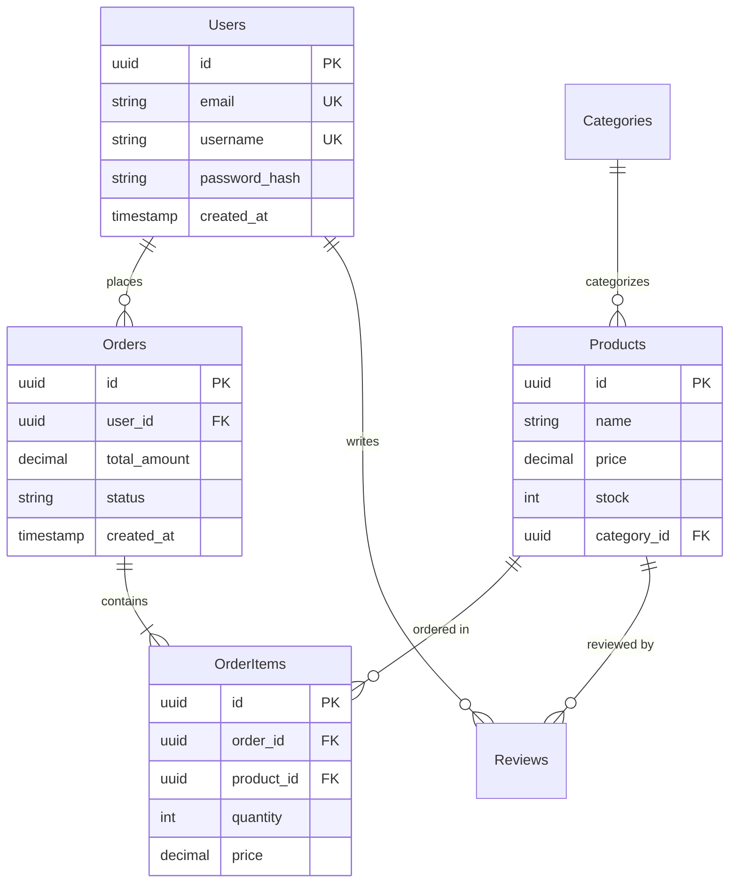

# Database Schema Design


## When to use this skill

Lists specific situations where this skill should be triggered:

- **New Project**: Database schema design for a new application
- **Schema Refactoring**: Redesigning an existing schema for performance or scalability
- **Relationship Definition**: Implementing 1:1, 1:N, N:M relationships between tables
- **Migration**: Safely applying schema changes
- **Performance Issues**: Index and schema optimization to resolve slow queries

## Input Format

The required and optional input information to collect from the user:

### Required Information
- **Database Type**: PostgreSQL, MySQL, MongoDB, SQLite, etc.
- **Domain Description**: What data will be stored (e.g., e-commerce, blog, social media)
- **Key Entities**: Core data objects (e.g., User, Product, Order)

### Optional Information
- **Expected Data Volume**: Small (<10K rows), Medium (10K-1M), Large (>1M) (default: Medium)
- **Read/Write Ratio**: Read-heavy, Write-heavy, Balanced (default: Balanced)
- **Transaction Requirements**: Whether ACID is required (default: true)
- **Sharding/Partitioning**: Whether large data distribution is needed (default: false)

### Input Example

```
Design a database for an e-commerce platform:
- DB: PostgreSQL
- Entities: User, Product, Order, Review
- Relationships:
  - A User can have multiple Orders
  - An Order contains multiple Products (N:M)
  - A Review is linked to a User and a Product
- Expected data: 100,000 users, 10,000 products
- Read-heavy (frequent product lookups)
```

## Instructions

Specifies the step-by-step task sequence to follow precisely.

### Step 1: Define Entities and Attributes

Identify core data objects and their attributes.

**Tasks**:
- Extract nouns from business requirements → entities
- List each entity's attributes (columns)
- Determine data types (VARCHAR, INTEGER, TIMESTAMP, JSON, etc.)
- Designate Primary Keys (UUID vs Auto-increment ID)

**Example** (E-commerce):
```
Users
- id: UUID PRIMARY KEY
- email: VARCHAR(255) UNIQUE NOT NULL
- username: VARCHAR(50) UNIQUE NOT NULL
- password_hash: VARCHAR(255) NOT NULL
- created_at: TIMESTAMP DEFAULT NOW()
- updated_at: TIMESTAMP DEFAULT NOW()

Products
- id: UUID PRIMARY KEY
- name: VARCHAR(255) NOT NULL
- description: TEXT
- price: DECIMAL(10, 2) NOT NULL
- stock: INTEGER DEFAULT 0
- category_id: UUID REFERENCES Categories(id)
- created_at: TIMESTAMP DEFAULT NOW()

Orders
- id: UUID PRIMARY KEY
- user_id: UUID REFERENCES Users(id)
- total_amount: DECIMAL(10, 2) NOT NULL
- status: VARCHAR(20) DEFAULT 'pending'
- created_at: TIMESTAMP DEFAULT NOW()

OrderItems (Junction table)
- id: UUID PRIMARY KEY
- order_id: UUID REFERENCES Orders(id) ON DELETE CASCADE
- product_id: UUID REFERENCES Products(id)
- quantity: INTEGER NOT NULL
- price: DECIMAL(10, 2) NOT NULL
```

### Step 2: Design Relationships and Normalization

Define relationships between tables and apply normalization.

**Tasks**:
- 1:1 relationship: Foreign Key + UNIQUE constraint
- 1:N relationship: Foreign Key
- N:M relationship: Create junction table
- Determine normalization level (1NF ~ 3NF)

**Decision Criteria**:
- OLTP systems → normalize to 3NF (data integrity)
- OLAP/analytics systems → denormalization allowed (query performance)
- Read-heavy → minimize JOINs with partial denormalization
- Write-heavy → full normalization to eliminate redundancy

**Example** (ERD Mermaid):


### Step 3: Establish Indexing Strategy

Design indexes for query performance.

**Tasks**:
- Primary Keys automatically create indexes
- Columns frequently used in WHERE clauses → add indexes
- Foreign Keys used in JOINs → indexes
- Consider composite indexes (WHERE col1 = ? AND col2 = ?)
- UNIQUE indexes (email, username, etc.)

**Checklist**:
- [x] Indexes on frequently queried columns
- [x] Indexes on Foreign Key columns
- [x] Composite index order optimized (high selectivity columns first)
- [x] Avoid excessive indexes (degrades INSERT/UPDATE performance)

**Example** (PostgreSQL):
```sql
-- Primary Keys (auto-indexed)
CREATE TABLE users (
    id UUID PRIMARY KEY DEFAULT gen_random_uuid(),
    email VARCHAR(255) UNIQUE NOT NULL,  -- UNIQUE = auto-indexed
    username VARCHAR(50) UNIQUE NOT NULL,
    password_hash VARCHAR(255) NOT NULL,
    created_at TIMESTAMP DEFAULT NOW(),
    updated_at TIMESTAMP DEFAULT NOW()
);

-- Foreign Keys + explicit indexes
CREATE TABLE orders (
    id UUID PRIMARY KEY DEFAULT gen_random_uuid(),
    user_id UUID NOT NULL REFERENCES users(id) ON DELETE CASCADE,
    total_amount DECIMAL(10, 2) NOT NULL,
    status VARCHAR(20) DEFAULT 'pending',
    created_at TIMESTAMP DEFAULT NOW()
);

CREATE INDEX idx_orders_user_id ON orders(user_id);
CREATE INDEX idx_orders_status ON orders(status);
CREATE INDEX idx_orders_created_at ON orders(created_at);

-- Composite index (status and created_at frequently queried together)
CREATE INDEX idx_orders_status_created ON orders(status, created_at DESC);

-- Products table
CREATE TABLE products (
    id UUID PRIMARY KEY DEFAULT gen_random_uuid(),
    name VARCHAR(255) NOT NULL,
    description TEXT,
    price DECIMAL(10, 2) NOT NULL CHECK (price >= 0),
    stock INTEGER DEFAULT 0 CHECK (stock >= 0),
    category_id UUID REFERENCES categories(id),
    created_at TIMESTAMP DEFAULT NOW()
);

CREATE INDEX idx_products_category ON products(category_id);
CREATE INDEX idx_products_price ON products(price);  -- price range search
CREATE INDEX idx_products_name ON products(name);    -- product name search

-- Full-text search (PostgreSQL)
CREATE INDEX idx_products_name_fts ON products USING GIN(to_tsvector('english', name));
CREATE INDEX idx_products_description_fts ON products USING GIN(to_tsvector('english', description));
```

### Step 4: Set Up Constraints and Triggers

Add constraints to ensure data integrity.

**Tasks**:
- NOT NULL: required columns
- UNIQUE: columns that must be unique
- CHECK: value range constraints (e.g., price >= 0)
- Foreign Key + CASCADE option
- Set default values

**Example**:
```sql
CREATE TABLE products (
    id UUID PRIMARY KEY DEFAULT gen_random_uuid(),
    name VARCHAR(255) NOT NULL,
    price DECIMAL(10, 2) NOT NULL CHECK (price >= 0),
    stock INTEGER DEFAULT 0 CHECK (stock >= 0),
    discount_percent INTEGER CHECK (discount_percent >= 0 AND discount_percent <= 100),
    category_id UUID REFERENCES categories(id) ON DELETE SET NULL,
    created_at TIMESTAMP DEFAULT NOW(),
    updated_at TIMESTAMP DEFAULT NOW()
);

-- Trigger: auto-update updated_at
CREATE OR REPLACE FUNCTION update_updated_at_column()
RETURNS TRIGGER AS $$
BEGIN
    NEW.updated_at = NOW();
    RETURN NEW;
END;
$$ LANGUAGE plpgsql;

CREATE TRIGGER update_products_updated_at
BEFORE UPDATE ON products
FOR EACH ROW
EXECUTE FUNCTION update_updated_at_column();
```

### Step 5: Write Migration Scripts

Write migrations that safely apply schema changes.

**Tasks**:
- UP migration: apply changes
- DOWN migration: rollback
- Wrap in transactions
- Prevent data loss (use ALTER TABLE carefully)

**Example** (SQL migration):
```sql
-- migrations/001_create_initial_schema.up.sql
BEGIN;

CREATE EXTENSION IF NOT EXISTS "uuid-ossp";

CREATE TABLE users (
    id UUID PRIMARY KEY DEFAULT gen_random_uuid(),
    email VARCHAR(255) UNIQUE NOT NULL,
    username VARCHAR(50) UNIQUE NOT NULL,
    password_hash VARCHAR(255) NOT NULL,
    created_at TIMESTAMP DEFAULT NOW(),
    updated_at TIMESTAMP DEFAULT NOW()
);

CREATE TABLE categories (
    id UUID PRIMARY KEY DEFAULT gen_random_uuid(),
    name VARCHAR(100) UNIQUE NOT NULL,
    parent_id UUID REFERENCES categories(id)
);

CREATE TABLE products (
    id UUID PRIMARY KEY DEFAULT gen_random_uuid(),
    name VARCHAR(255) NOT NULL,
    description TEXT,
    price DECIMAL(10, 2) NOT NULL CHECK (price >= 0),
    stock INTEGER DEFAULT 0 CHECK (stock >= 0),
    category_id UUID REFERENCES categories(id),
    created_at TIMESTAMP DEFAULT NOW(),
    updated_at TIMESTAMP DEFAULT NOW()
);

CREATE INDEX idx_products_category ON products(category_id);
CREATE INDEX idx_products_price ON products(price);

COMMIT;

-- migrations/001_create_initial_schema.down.sql
BEGIN;

DROP TABLE IF EXISTS products CASCADE;
DROP TABLE IF EXISTS categories CASCADE;
DROP TABLE IF EXISTS users CASCADE;

COMMIT;
```

## Output format

Defines the exact format that deliverables should follow.

### Basic Structure

```
project/
├── database/
│   ├── schema.sql                    # full schema
│   ├── migrations/
│   │   ├── 001_create_users.up.sql
│   │   ├── 001_create_users.down.sql
│   │   ├── 002_create_products.up.sql
│   │   └── 002_create_products.down.sql
│   ├── seeds/
│   │   └── sample_data.sql           # test data
│   └── docs/
│       ├── ERD.md                     # Mermaid ERD diagram
│       └── SCHEMA.md                  # schema documentation
└── README.md
```

### ERD Diagram (Mermaid Format)

```markdown
# Database Schema

## Entity Relationship Diagram

\`\`\`mermaid
erDiagram
    Users ||--o{ Orders : places
    Orders ||--|{ OrderItems : contains
    Products ||--o{ OrderItems : "ordered in"

    Users {
        uuid id PK
        string email UK
        string username UK
    }

    Products {
        uuid id PK
        string name
        decimal price
    }
\`\`\`

## Table Descriptions

### users
- **Purpose**: Store user account information
- **Indexes**: email, username
- **Estimated rows**: 100,000

### products
- **Purpose**: Product catalog
- **Indexes**: category_id, price, name
- **Estimated rows**: 10,000
```

## Constraints

Specifies mandatory rules and prohibited actions.

### Mandatory Rules (MUST)

1. **Primary Key Required**: Define a Primary Key on every table
   - Unique record identification
   - Ensures referential integrity

2. **Explicit Foreign Keys**: Tables with relationships must define Foreign Keys
   - Specify ON DELETE CASCADE/SET NULL options
   - Prevent orphan records

3. **Use NOT NULL Appropriately**: Required columns must be NOT NULL
   - Clearly specify nullable vs. non-nullable
   - Providing defaults is recommended

### Prohibited Actions (MUST NOT)

1. **Avoid EAV Pattern Abuse**: Use the Entity-Attribute-Value pattern only in special cases
   - Query complexity increases dramatically
   - Performance degradation

2. **Excessive Denormalization**: Be careful when denormalizing for performance
   - Data consistency issues
   - Risk of update anomalies

3. **No Plaintext Storage of Sensitive Data**: Never store passwords, card numbers, etc. in plaintext
   - Hashing/encryption is mandatory
   - Legal liability issues

### Security Rules

- **Principle of Least Privilege**: Grant only the necessary permissions to application DB accounts
- **SQL Injection Prevention**: Use Prepared Statements / Parameterized Queries
- **Encrypt Sensitive Columns**: Consider encrypting personally identifiable information at rest

## Examples

Demonstrates how to apply the skill through real-world use cases.

### Example 1: Blog Platform Schema

**Situation**: Database design for a Medium-style blog platform

**User Request**:
```
Design a PostgreSQL schema for a blog platform:
- Users can write multiple posts
- Posts can have multiple tags (N:M)
- Users can like and bookmark posts
- Comment feature (with nested replies)
```

**Final Result**:
```sql
-- Users
CREATE TABLE users (
    id UUID PRIMARY KEY DEFAULT gen_random_uuid(),
    email VARCHAR(255) UNIQUE NOT NULL,
    username VARCHAR(50) UNIQUE NOT NULL,
    bio TEXT,
    avatar_url VARCHAR(500),
    created_at TIMESTAMP DEFAULT NOW()
);

-- Posts
CREATE TABLE posts (
    id UUID PRIMARY KEY DEFAULT gen_random_uuid(),
    author_id UUID NOT NULL REFERENCES users(id) ON DELETE CASCADE,
    title VARCHAR(255) NOT NULL,
    slug VARCHAR(255) UNIQUE NOT NULL,
    content TEXT NOT NULL,
    published_at TIMESTAMP,
    created_at TIMESTAMP DEFAULT NOW(),
    updated_at TIMESTAMP DEFAULT NOW()
);

CREATE INDEX idx_posts_author ON posts(author_id);
CREATE INDEX idx_posts_published ON posts(published_at);
CREATE INDEX idx_posts_slug ON posts(slug);

-- Tags
CREATE TABLE tags (
    id UUID PRIMARY KEY DEFAULT gen_random_uuid(),
    name VARCHAR(50) UNIQUE NOT NULL,
    slug VARCHAR(50) UNIQUE NOT NULL
);

-- Post-Tag relationship (N:M)
CREATE TABLE post_tags (
    post_id UUID REFERENCES posts(id) ON DELETE CASCADE,
    tag_id UUID REFERENCES tags(id) ON DELETE CASCADE,
    PRIMARY KEY (post_id, tag_id)
);

CREATE INDEX idx_post_tags_post ON post_tags(post_id);
CREATE INDEX idx_post_tags_tag ON post_tags(tag_id);

-- Likes
CREATE TABLE post_likes (
    user_id UUID REFERENCES users(id) ON DELETE CASCADE,
    post_id UUID REFERENCES posts(id) ON DELETE CASCADE,
    created_at TIMESTAMP DEFAULT NOW(),
    PRIMARY KEY (user_id, post_id)
);

-- Bookmarks
CREATE TABLE post_bookmarks (
    user_id UUID REFERENCES users(id) ON DELETE CASCADE,
    post_id UUID REFERENCES posts(id) ON DELETE CASCADE,
    created_at TIMESTAMP DEFAULT NOW(),
    PRIMARY KEY (user_id, post_id)
);

-- Comments (self-referencing for nested comments)
CREATE TABLE comments (
    id UUID PRIMARY KEY DEFAULT gen_random_uuid(),
    post_id UUID NOT NULL REFERENCES posts(id) ON DELETE CASCADE,
    author_id UUID NOT NULL REFERENCES users(id) ON DELETE CASCADE,
    parent_comment_id UUID REFERENCES comments(id) ON DELETE CASCADE,
    content TEXT NOT NULL,
    created_at TIMESTAMP DEFAULT NOW(),
    updated_at TIMESTAMP DEFAULT NOW()
);

CREATE INDEX idx_comments_post ON comments(post_id);
CREATE INDEX idx_comments_author ON comments(author_id);
CREATE INDEX idx_comments_parent ON comments(parent_comment_id);
```

### Example 2: MongoDB Schema (NoSQL)

**Situation**: MongoDB schema for a real-time chat app

**User Request**:
```
Design a MongoDB schema for a real-time chat app.
Reads are very frequent, and message history needs to be retrieved quickly.
```

**Final Result**:
```javascript
// users collection
{
  _id: ObjectId,
  username: String,  // indexed, unique
  email: String,     // indexed, unique
  avatar_url: String,
  status: String,    // 'online', 'offline', 'away'
  last_seen: Date,
  created_at: Date
}

// conversations collection (denormalized - read-optimized)
{
  _id: ObjectId,
  participants: [    // indexed
    {
      user_id: ObjectId,
      username: String,
      avatar_url: String
    }
  ],
  last_message: {    // denormalized for fast recent-message retrieval
    content: String,
    sender_id: ObjectId,
    sent_at: Date
  },
  unread_counts: {   // unread message count per participant
    "user_id_1": 5,
    "user_id_2": 0
  },
  created_at: Date,
  updated_at: Date
}

// messages collection
{
  _id: ObjectId,
  conversation_id: ObjectId,  // indexed
  sender_id: ObjectId,
  content: String,
  attachments: [
    {
      type: String,  // 'image', 'file', 'video'
      url: String,
      filename: String
    }
  ],
  read_by: [ObjectId],  // array of user IDs who have read the message
  sent_at: Date,        // indexed
  edited_at: Date
}

// Indexes
db.users.createIndex({ username: 1 }, { unique: true });
db.users.createIndex({ email: 1 }, { unique: true });

db.conversations.createIndex({ "participants.user_id": 1 });
db.conversations.createIndex({ updated_at: -1 });

db.messages.createIndex({ conversation_id: 1, sent_at: -1 });
db.messages.createIndex({ sender_id: 1 });
```

**Design Highlights**:
- Denormalization for read optimization (embedding last_message)
- Indexes on frequently accessed fields
- Using array fields (participants, read_by)

## Best practices

### Quality Improvement

1. **Naming Convention Consistency**: Use snake_case for table/column names
   - users, post_tags, created_at
   - Be consistent with plurals/singulars (tables plural, columns singular, etc.)

2. **Consider Soft Delete**: Use logical deletion instead of physical deletion for important data
   - deleted_at TIMESTAMP (NULL = active, NOT NULL = deleted)
   - Allows recovery of accidentally deleted data
   - Audit trail

3. **Timestamps Required**: Include created_at and updated_at in most tables
   - Data tracking and debugging
   - Time-series analysis

### Efficiency Improvements

- **Partial Indexes**: Minimize index size with conditional indexes
  ```sql
  CREATE INDEX idx_posts_published ON posts(published_at) WHERE published_at IS NOT NULL;
  ```
- **Materialized Views**: Cache complex aggregate queries as Materialized Views
- **Partitioning**: Partition large tables by date/range

## Common Issues

### Issue 1: N+1 Query Problem

**Symptom**: Multiple DB calls when a single query would suffice

**Cause**: Individual lookups in a loop without JOINs

**Solution**:
```sql
-- ❌ Bad example: N+1 queries
SELECT * FROM posts;  -- 1 time
-- for each post
SELECT * FROM users WHERE id = ?;  -- N times

-- ✅ Good example: 1 query
SELECT posts.*, users.username, users.avatar_url
FROM posts
JOIN users ON posts.author_id = users.id;
```

### Issue 2: Slow JOINs Due to Unindexed Foreign Keys

**Symptom**: JOIN queries are very slow

**Cause**: Missing index on Foreign Key column

**Solution**:
```sql
CREATE INDEX idx_orders_user_id ON orders(user_id);
CREATE INDEX idx_order_items_order_id ON order_items(order_id);
CREATE INDEX idx_order_items_product_id ON order_items(product_id);
```

### Issue 3: UUID vs Auto-increment Performance

**Symptom**: Insert performance degradation when using UUID Primary Keys

**Cause**: UUIDs are random, causing index fragmentation

**Solution**:
- PostgreSQL: Use `uuid_generate_v7()` (time-ordered UUID)
- MySQL: Use `UUID_TO_BIN(UUID(), 1)`
- Or consider using Auto-increment BIGINT

## References

### Official Documentation
- [PostgreSQL Documentation](https://www.postgresql.org/docs/)
- [MySQL Documentation](https://dev.mysql.com/doc/)
- [MongoDB Schema Design Best Practices](https://www.mongodb.com/docs/manual/core/data-modeling-introduction/)

### Tools
- [dbdiagram.io](https://dbdiagram.io/) - ERD diagram creation
- [PgModeler](https://pgmodeler.io/) - PostgreSQL modeling tool
- [Prisma](https://www.prisma.io/) - ORM + migrations

### Learning Resources
- [Database Design Course (freecodecamp)](https://www.youtube.com/watch?v=ztHopE5Wnpc)
- [Use The Index, Luke](https://use-the-index-luke.com/) - SQL indexing guide

## Metadata

### Version
- **Current Version**: 1.0.0
- **Last Updated**: 2025-01-01

### Tags
`#database` `#schema` `#PostgreSQL` `#MySQL` `#MongoDB` `#SQL` `#NoSQL` `#migration` `#ERD`
