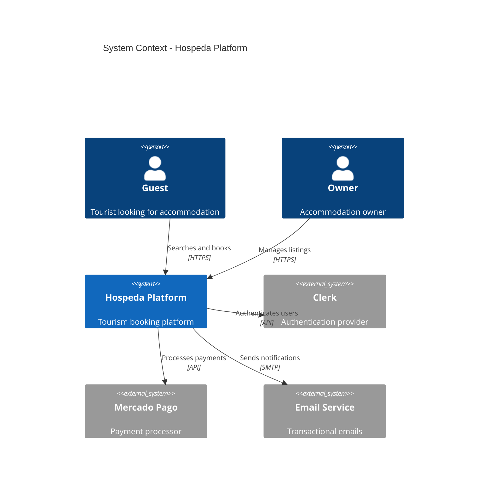
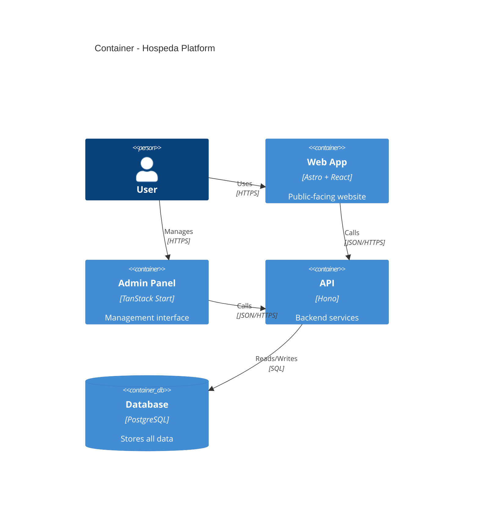
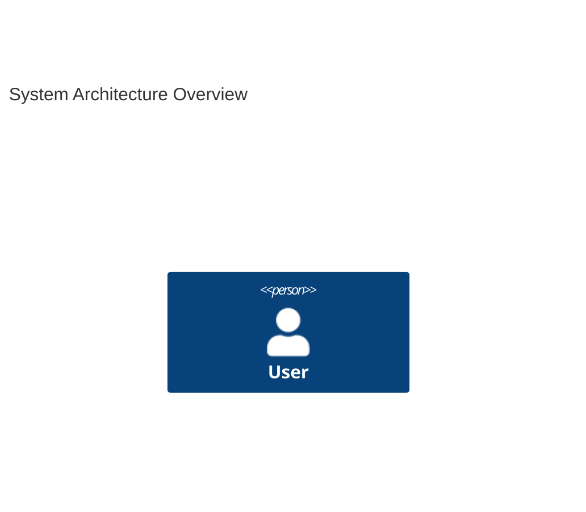

# C4 Architecture Diagrams Reference

## Table of Contents
- [Overview](#overview)
- [Context Level](#context-level)
- [Container Level](#container-level)
- [Component Level](#component-level)
- [Accessibility](#accessibility)
- [Validation Checklist](#validation-checklist)

## Overview
C4 diagrams describe a system's architecture at multiple levels of abstraction.

## Context Level


## Container Level


## Component Level
```mermaid
C4Component
    title Components - API Application

    Container(api, "API", "Hono")

    Component(routes, "Routes", "Hono Router", "HTTP endpoints")
    Component(services, "Services", "Business Logic", "Domain operations")
    Component(models, "Models", "Data Access", "DB operations")
    Component(middleware, "Middleware", "Cross-cutting", "Auth, logging, errors")

    Rel(routes, middleware, "Uses")
    Rel(routes, services, "Calls")
    Rel(services, models, "Uses")
     Rel(models, db, "Queries")
```

## Accessibility

For full accessibility patterns, see [accessibility.md](accessibility.md).

Example:


## Validation Checklist
- [ ] Appropriate level selected
- [ ] All systems/containers shown
- [ ] Relationships clear
- [ ] External systems identified
- [ ] Accessibility attributes present
