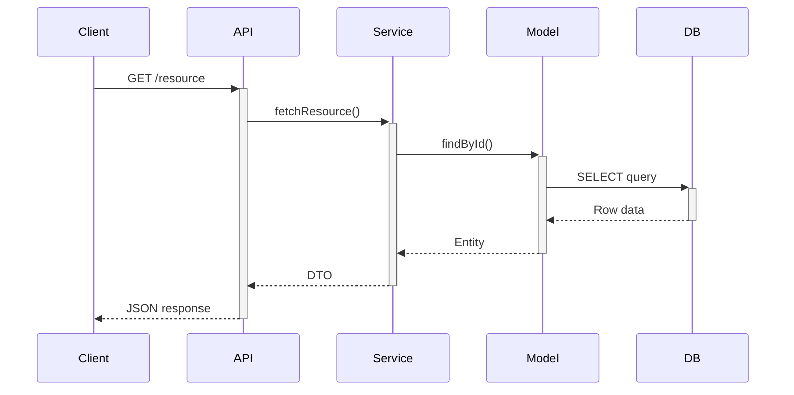
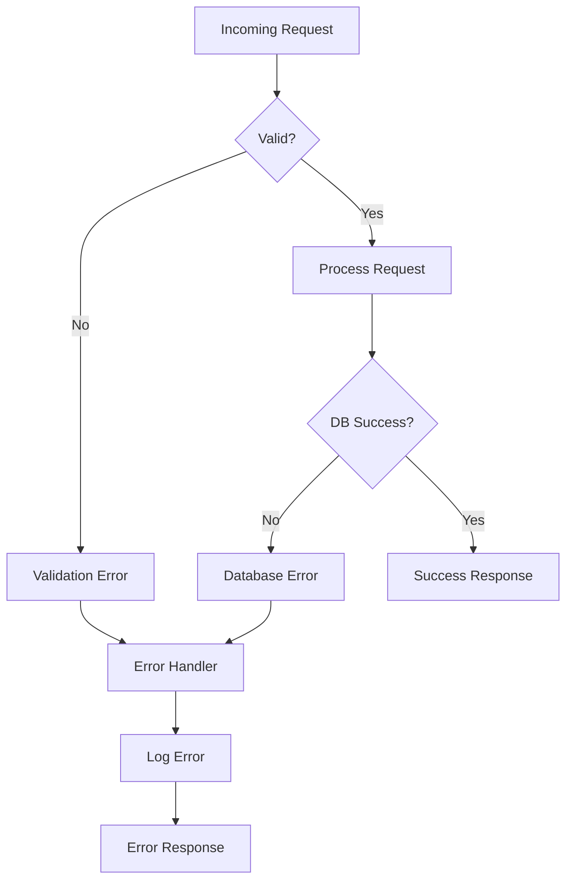
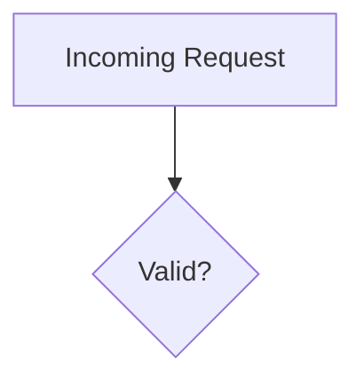

# Common Mermaid Patterns Reference

## Table of Contents
- [API Request Flow](#api-request-flow)
- [Error Handling Flow](#error-handling-flow)
- [Accessibility](#accessibility)

## API Request Flow

## Error Handling Flow

## Accessibility

For full accessibility patterns, see [accessibility.md](accessibility.md).

Example:

