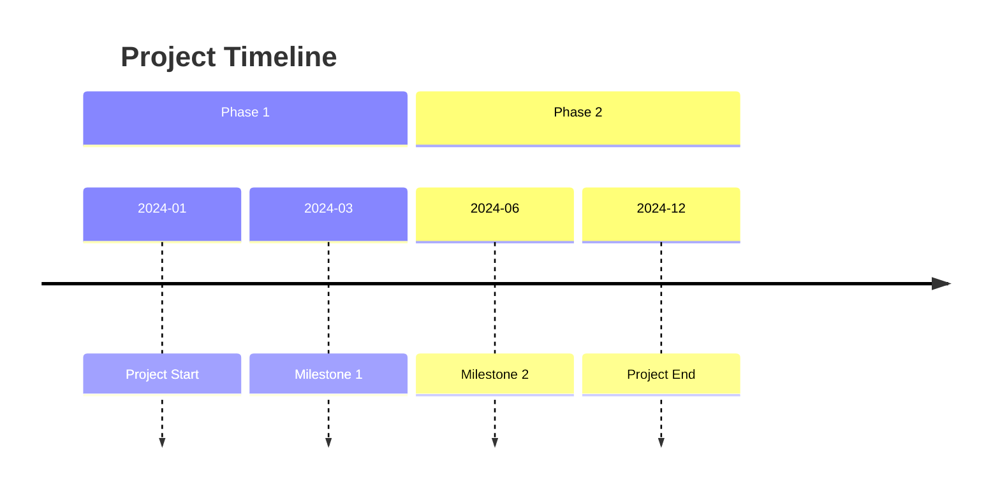
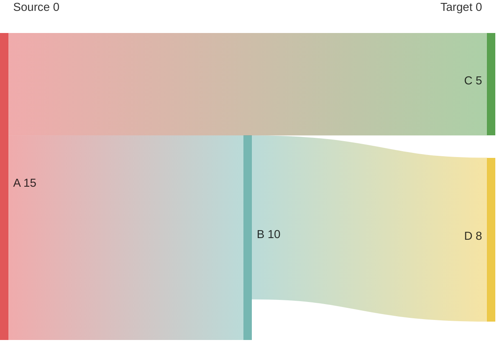
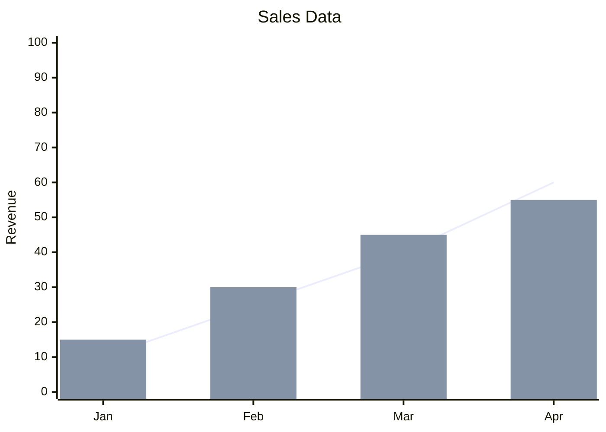
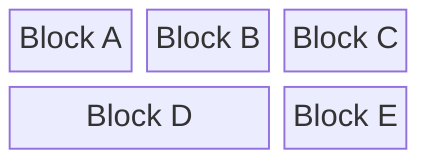

# Experimental Mermaid Diagrams Reference

⚠️ **Warning: These features are experimental and may change or break in future Mermaid versions.** Use with caution in production documentation.

## Table of Contents
- [Timeline](#timeline)
- [Sankey Diagram](#sankey-diagram)
- [XY Chart](#xy-chart)
- [Block Diagram](#block-diagram)
- [Architecture (Proposal)](#architecture-proposal)

---

## Timeline
The Timeline diagram is used for visualizing events over time. It is relatively stable compared to other experimental types but still resides in the experimental category.

### Syntax Example

### Format
- `timeline`: Keyword to start the diagram.
- `title`: Optional title.
- `section`: Optional logical grouping.
- `{time} : {event}`: Basic unit of data.

### Validation Checklist
- [ ] Uses `timeline` keyword.
- [ ] Events follow the `{time} : {description}` pattern.
- [ ] Indentation is consistent for sections and items.

### Known Limitations
- Layout is primarily horizontal and can become cramped with many events.
- Styling options are more limited than Flowcharts.

---

## Sankey Diagram
Sankey diagrams visualize flows from one set of values to another. In Mermaid, it is currently in beta.

### Syntax Example

### Format
- `sankey-beta`: Required prefix.
- CSV-like data format: `Source,Target,Value`.

### Validation Checklist
- [ ] Starts with `sankey-beta`.
- [ ] Each flow line has exactly three comma-separated columns.
- [ ] Value is a number.

### Known Limitations
- Rendering can be heavy for large datasets.
- Limited control over node placement and color themes.

---

## XY Chart
XY Charts allow for rendering line and bar charts directly within Mermaid.

### Syntax Example

### Format
- `xychart-beta`: Required prefix.
- `x-axis`: Define labels in brackets `[]`.
- `y-axis`: Define title and range `min --> max`.
- `line` / `bar`: Provide data points in brackets `[]`.

### Validation Checklist
- [ ] Starts with `xychart-beta`.
- [ ] Data point count matches x-axis label count.
- [ ] Y-axis range is correctly defined with `-->`.

### Known Limitations
- Limited to basic line and bar types.
- Minimal styling for axes and legends.

---

## Block Diagram
Block diagrams provide a way to create structured grid-based layouts of blocks.

### Syntax Example

### Format
- `block-beta`: Required prefix.
- `columns N`: Defines the grid width.
- `id["Label"]`: Defines a block.
- `:N`: Optional span (e.g., `:2` spans two columns).

### Validation Checklist
- [ ] Starts with `block-beta`.
- [ ] `columns` is defined early.
- [ ] Spans do not exceed the defined column count.

### Known Limitations
- Auto-layout is strictly grid-based.
- Complex nesting can be difficult to manage.

---

## Architecture (Proposal)
Mermaid has a proposed syntax for Architecture diagrams to visualize cloud infrastructure and system components.

**Status:** This diagram type is still in the proposal/design stage and may not be available in all Mermaid distributions. It is intended to support specialized icons and layout rules for system architecture.

Refer to the [official Mermaid documentation](https://mermaid.js.org/syntax/architecture.html) for the latest updates on this implementation.

---

## General Troubleshooting for Experimental Diagrams
1. **Version Check**: Ensure your Mermaid renderer is at least v10.3.0+.
2. **Prefixes**: Many experimental types require the `-beta` suffix.
3. **Fallback**: If a diagram fails to render, check the console for syntax errors or check if the specific environment (e.g., GitHub, Notion, Obsidian) supports the latest Mermaid version.
