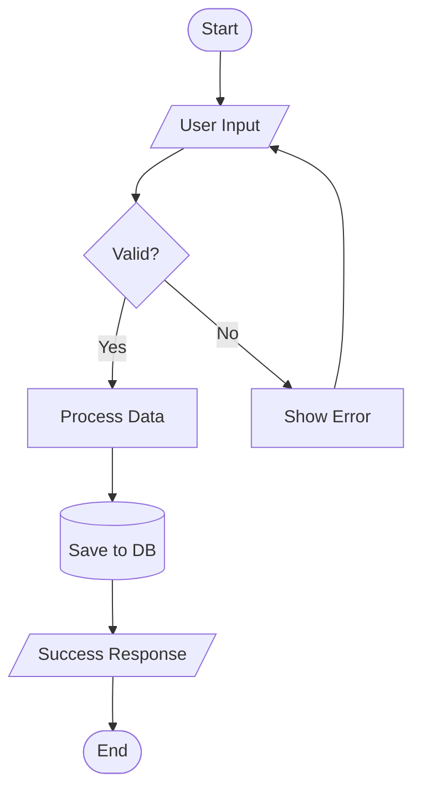
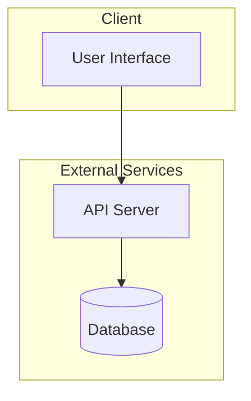
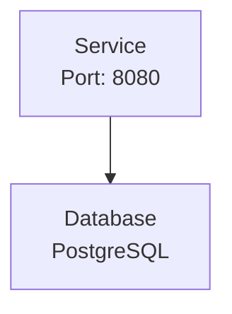
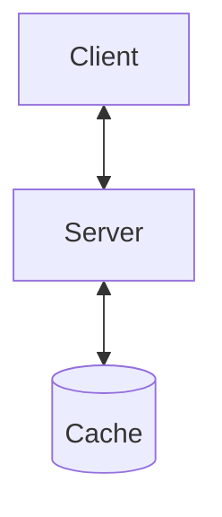
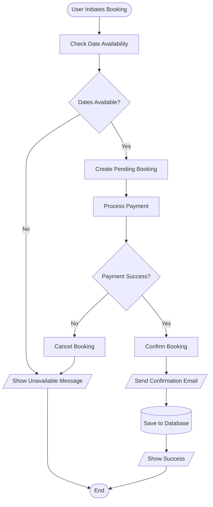
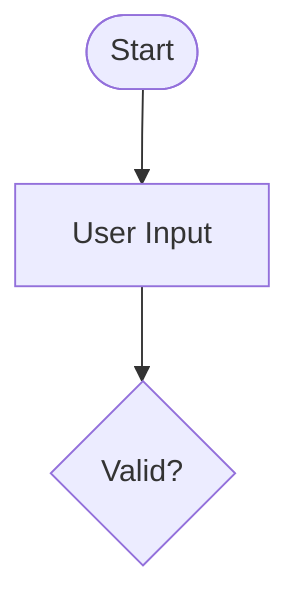

# Flowchart Diagrams Reference

## Table of Contents
- [Overview](#overview)
- [Syntax Overview](#syntax-overview)
- [Node Shapes](#node-shapes)
- [Direction Options](#direction-options)
- [Subgraphs](#subgraphs)
- [Multi-line Labels](#multi-line-labels)
- [Bidirectional Arrows](#bidirectional-arrows)
- [Example](#example)
- [Accessibility](#accessibility)
- [Validation Checklist](#validation-checklist)

## Overview
Flowchart diagrams visualize processes and decision paths, aiding understanding of workflows.

## Syntax Overview
Syntax:

## Node Shapes
- `[Rectangle]` - Process step
- `([Rounded])` - Start/End
- `{Diamond}` - Decision
- `[/Parallelogram/]` - Input/Output
- `[(Database)]` - Data storage
- `((Circle))` - Connector

## Direction Options
- `TD` - Top to Down
- `LR` - Left to Right
- `BT` - Bottom to Top
- `RL` - Right to Left

## Subgraphs
Group related nodes using subgraphs. Useful for representing systems, services, or logical boundaries.

## Multi-line Labels
Use ` ` to split labels across multiple lines for readability.

## Bidirectional Arrows
Use `<-->` for connections that can flow in both directions.

## Example

## Accessibility
Add accessibility attributes to ensure diagrams are understandable to screen readers and automated tools.

See [accessibility.md](accessibility.md) for comprehensive accessibility guidelines.

## Validation Checklist
- [ ] All paths covered
- [ ] Decision points clear
- [ ] Start and end defined
- [ ] Flow direction logical
- [ ] Accessibility attributes present
- [ ] Subgraphs named descriptively
