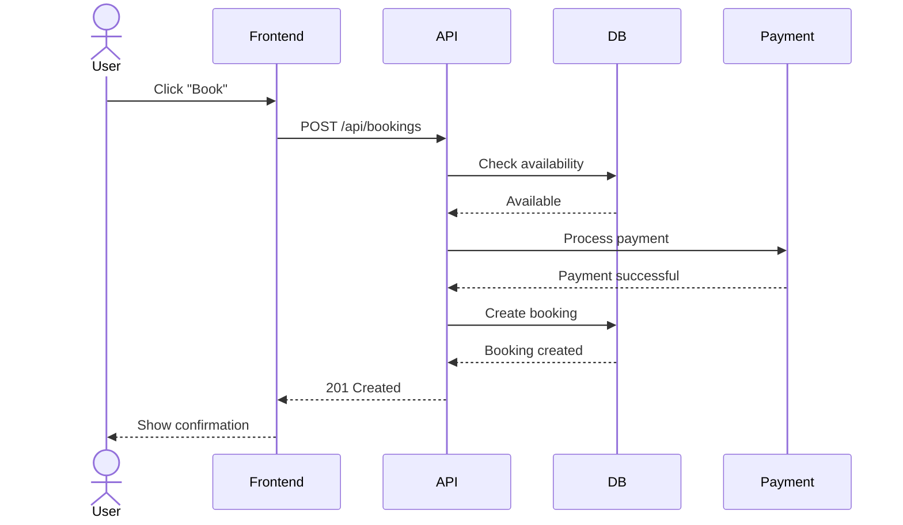
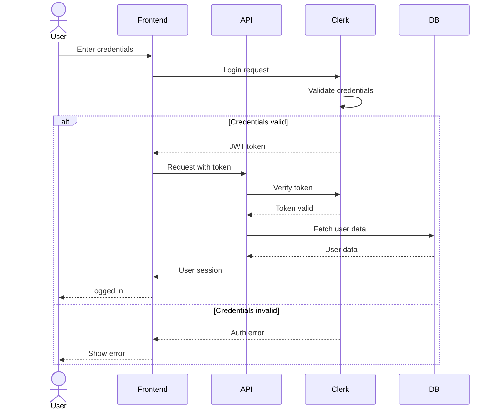
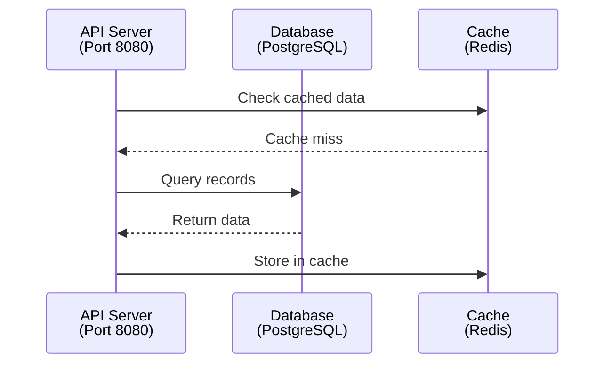
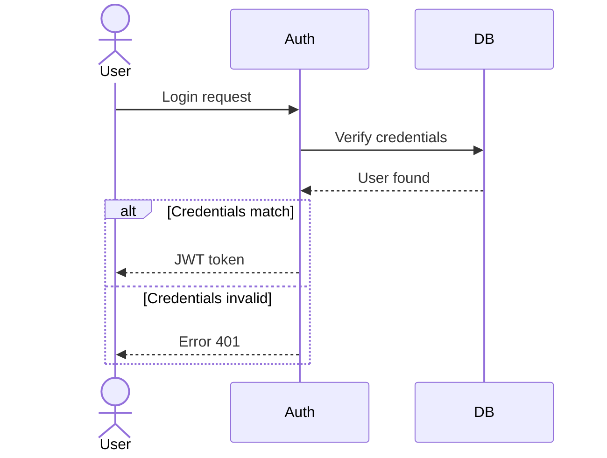

# Sequence Diagrams Reference

## Table of Contents
- [Overview](#overview)
- [Syntax Overview](#syntax-overview)
- [Participant Types](#participant-types)
- [Arrow Types](#arrow-types)
- [Example](#example)
- [Multi-line Participant Names](#multi-line-participant-names)
- [Accessibility](#accessibility)
- [Validation Checklist](#validation-checklist)

## Overview
Sequence diagrams describe interactions and message flows between actors and systems.

## Syntax Overview
Syntax:

## Participant Types
- `actor` - Human user
- `participant` - System/Service
- `database` - Database

## Arrow Types
- `->` - Solid line (synchronous)
- `-->` - Dotted line (response)
- `->>` - Solid arrow (async message)
- `-->>` - Dotted arrow (async response)

## Example - Authentication Flow:

## Multi-line Participant Names
Use ` ` tags to display participant names across multiple lines. This improves readability for long names or when adding metadata like port numbers or service types.

Example with multi-line participant names:

**Best practices**:
- Use descriptive aliases (e.g., `API as API Server (Port 8080)`)
- Include relevant context like port numbers, database type, or service version
- Keep lines concise to avoid excessive wrapping

## Accessibility
Sequence diagrams should include accessibility attributes to ensure diagrams are usable by assistive technologies. See [accessibility.md](accessibility.md) for comprehensive accessibility guidance.

Example with accessibility attributes:

**Accessibility requirements**:
- Use `accTitle:` for a brief diagram title
- Use `accDescr:` for a detailed description of the diagram flow
- Ensure `actor` and `participant` labels are descriptive
- Test diagrams with screen readers to verify clarity

## Validation Checklist
- [ ] All participants identified
- [ ] Message flow logical
- [ ] Return messages shown
- [ ] Alt/loop blocks used correctly
- [ ] Accessibility attributes present (accTitle, accDescr)
- [ ] Participant aliases descriptive

