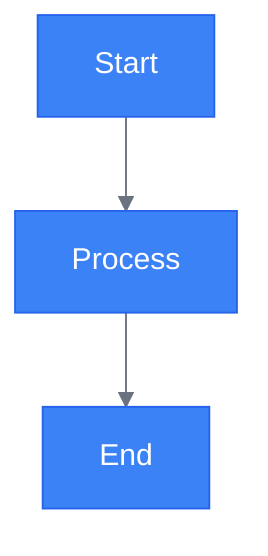
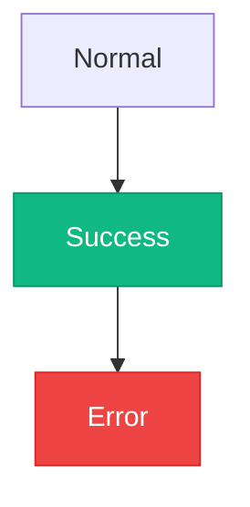

# Mermaid Styling Reference

## Table of Contents
- [Overview](#overview)
- [Theme Application](#theme-application)
- [Class Styling](#class-styling)
- [Validation Checklist](#validation-checklist)

## Overview
This section covers applying consistent styling to diagrams for branding and readability.

## Theme Application

## Class Styling

## Validation Checklist
- [ ] Colors match brand
- [ ] Contrast sufficient
- [ ] Styling consistent
- [ ] Readable in both themes
