# Mermaid Diagram Specialist

## Overview

**Purpose**: Expert in creating comprehensive Mermaid diagrams for
documentation, architecture visualization, and process mapping

**Category**: Tech **Primary Users**: tech-writer, architecture-validator,
product-technical, tech-lead

## When to Use This Skill

- Creating architecture documentation
- Visualizing workflows and processes
- Documenting data models (ERDs)
- Explaining sequence flows
- Creating state machines
- Documenting component relationships
- Creating decision trees
- Visualizing user journeys

## Prerequisites

**Required:**

- Understanding of the system/process to document
- Access to technical specifications
- Knowledge of diagram type needed

**Optional:**

- Design system colors for consistency
- Existing documentation to reference

## Input

**What the skill needs:**

- Process/system description
- Entities and relationships (for ERDs)
- Component interactions (for sequence diagrams)
- Architecture layers (for C4 diagrams)
- States and transitions (for state diagrams)

## Workflow

### Step 1: Diagram Type Selection

**Objective**: Choose appropriate diagram type for requirements

**Available Diagram Types:**

1. **Flowchart**: Decision flows, algorithms, processes
2. **Sequence Diagram**: API interactions, message flows
3. **ERD**: Database schemas, entity relationships
4. **Class Diagram**: Object-oriented design
5. **State Diagram**: State machines, lifecycle
6. **Gantt Chart**: Project timelines, schedules
7. **C4 Diagram**: Architecture at different levels
8. **Pie/Bar Charts**: Data visualization
9. **Git Graph**: Version control flows
10. **User Journey**: User experience flows

**Decision Matrix:**

- Process with decisions → **Flowchart**
- API/system interactions → **Sequence Diagram**
- Database structure → **ERD**
- System architecture → **C4 Diagram**
- Object relationships → **Class Diagram**
- State transitions → **State Diagram**
- Project timeline → **Gantt Chart**

**Validation:**

- [ ] Diagram type matches content
- [ ] Complexity appropriate
- [ ] Audience considered
- [ ] Purpose clear

**Output**: Selected diagram type

### Step 2: Flowchart Creation

**Objective**: Create process and decision flow diagrams

**Syntax:**

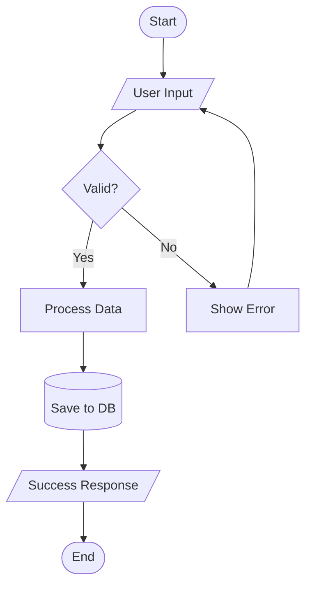

**Node Shapes:**

- `[Rectangle]` - Process step
- `([Rounded])` - Start/End
- `{Diamond}` - Decision
- `[/Parallelogram/]` - Input/Output
- `[(Database)]` - Data storage
- `((Circle))` - Connector

**Direction Options:**

- `TD` - Top to Down
- `LR` - Left to Right
- `BT` - Bottom to Top
- `RL` - Right to Left

**Example - Booking Flow:**

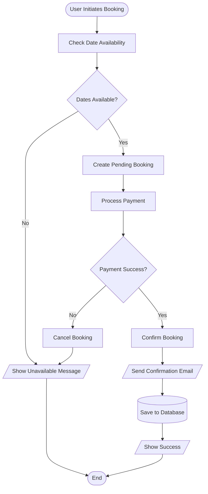

**Validation:**

- [ ] All paths covered
- [ ] Decision points clear
- [ ] Start and end defined
- [ ] Flow direction logical

**Output**: Process flowchart

### Step 3: Sequence Diagram Creation

**Objective**: Document API interactions and message flows

**Syntax:**

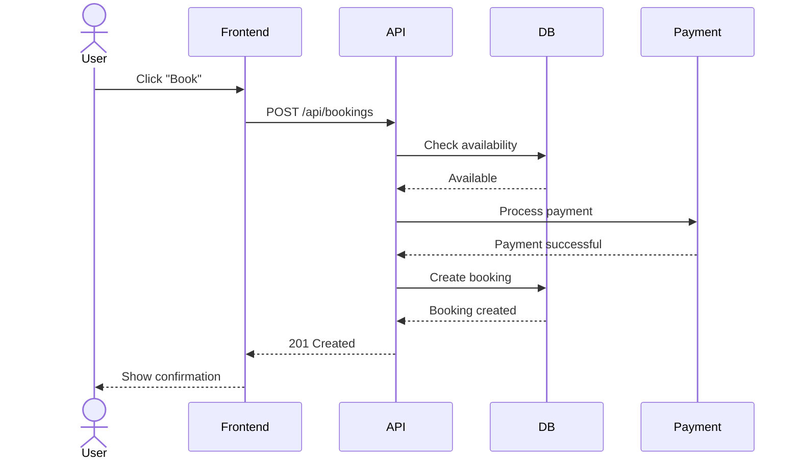

**Participant Types:**

- `actor` - Human user
- `participant` - System/Service
- `database` - Database

**Arrow Types:**

- `->` - Solid line (synchronous)
- `-->` - Dotted line (response)
- `->>` - Solid arrow (async message)
- `-->>` - Dotted arrow (async response)

**Example - Authentication Flow:**

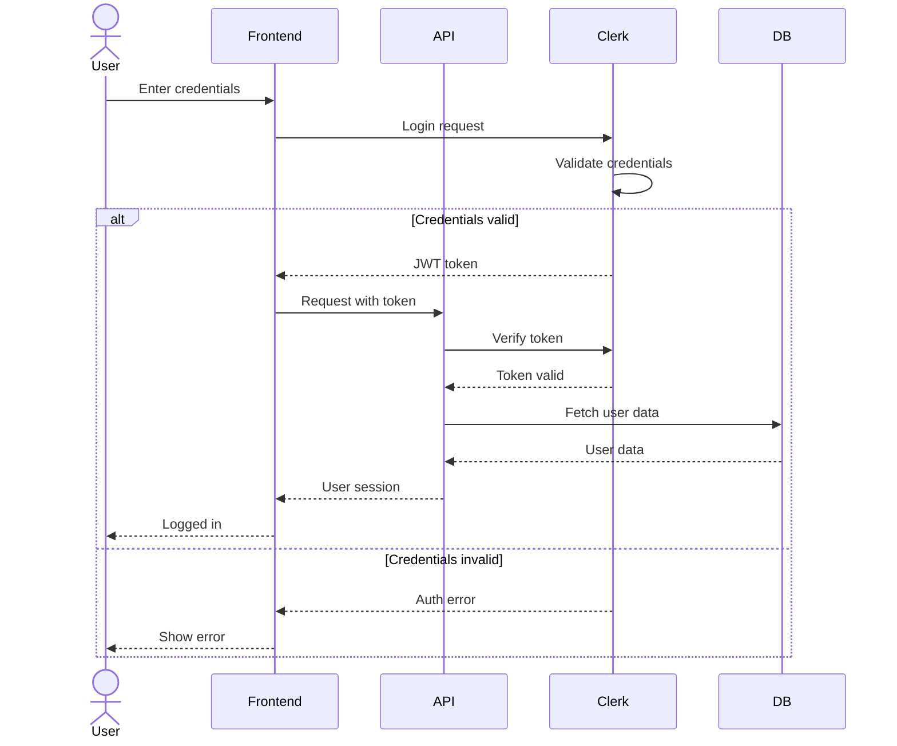

**Validation:**

- [ ] All participants identified
- [ ] Message flow logical
- [ ] Return messages shown
- [ ] Alt/loop blocks used correctly

**Output**: Sequence diagram

### Step 4: ERD Creation

**Objective**: Document database schema and relationships

**Syntax:**

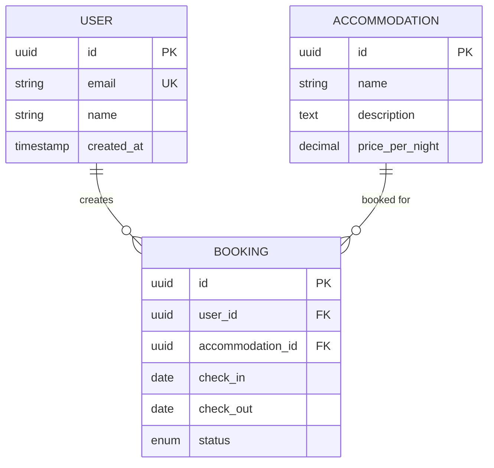

**Relationship Types:**

- `||--||` - One to one
- `||--o{` - One to many
- `}o--o{` - Many to many
- `||--o|` - One to zero or one

**Cardinality Symbols:**

- `||` - Exactly one
- `o|` - Zero or one
- `}o` - Zero or more
- `}|` - One or more

**Example - Full Hospeda ERD:**

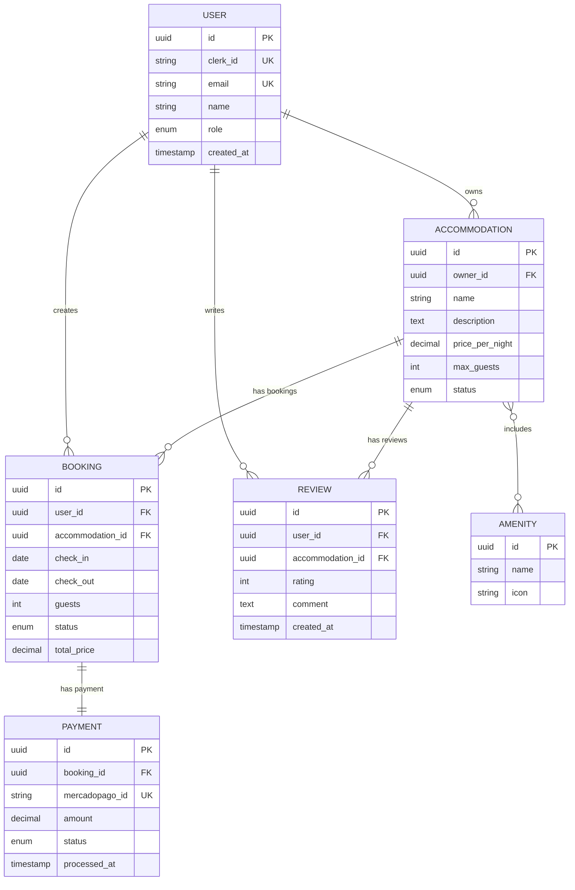

**Validation:**

- [ ] All entities defined
- [ ] Relationships accurate
- [ ] Cardinality correct
- [ ] Primary/Foreign keys marked

**Output**: ERD diagram

### Step 5: C4 Architecture Diagrams

**Objective**: Document system architecture at different levels

**Context Level** (System in environment):

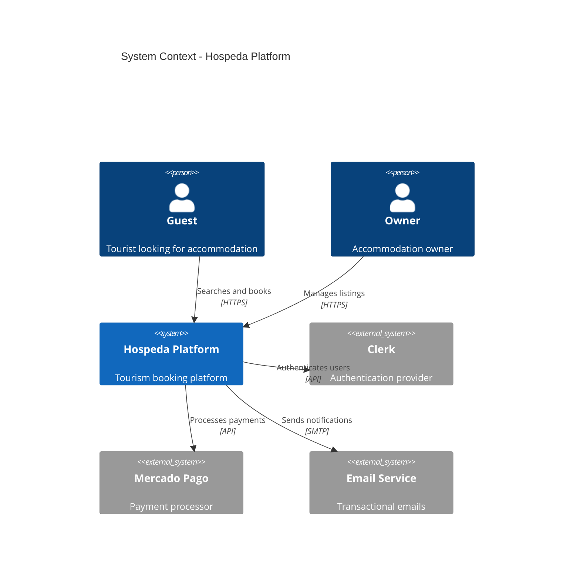

**Container Level** (Applications and data stores):

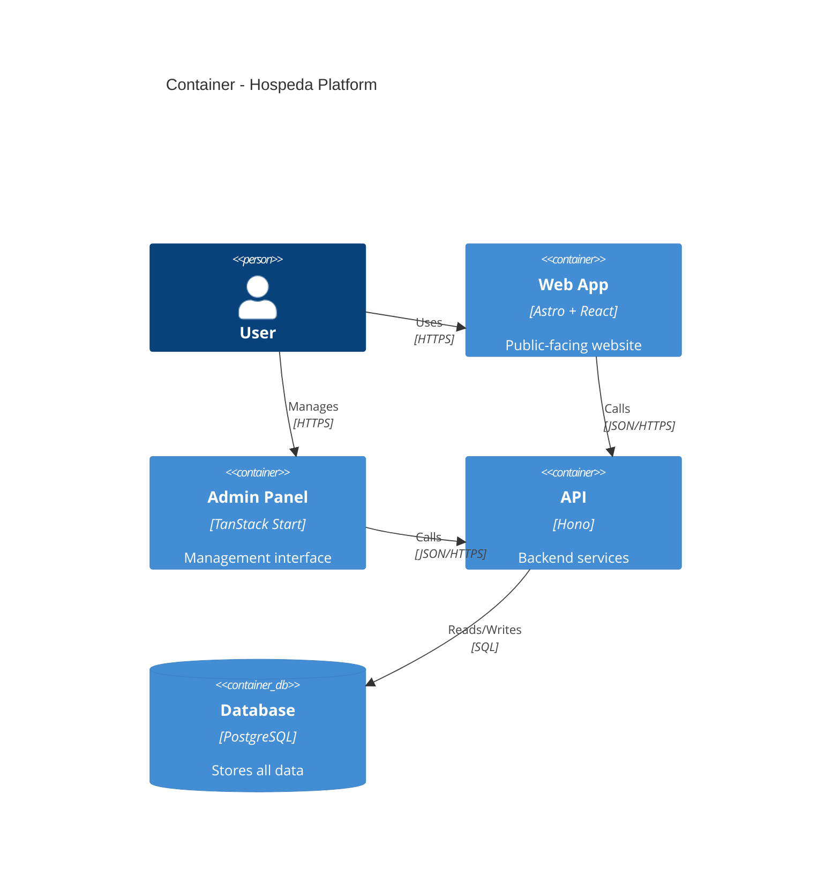

**Component Level** (Internal structure):

```mermaid
C4Component
    title Components - API Application

    Container(api, "API", "Hono")

    Component(routes, "Routes", "Hono Router", "HTTP endpoints")
    Component(services, "Services", "Business Logic", "Domain operations")
    Component(models, "Models", "Data Access", "DB operations")
    Component(middleware, "Middleware", "Cross-cutting", "Auth, logging, errors")

    Rel(routes, middleware, "Uses")
    Rel(routes, services, "Calls")
    Rel(services, models, "Uses")
    Rel(models, db, "Queries")
```

**Validation:**

- [ ] Appropriate level selected
- [ ] All systems/containers shown
- [ ] Relationships clear
- [ ] External systems identified

**Output**: C4 architecture diagrams

### Step 6: State Diagram Creation

**Objective**: Document state machines and lifecycles

**Syntax:**

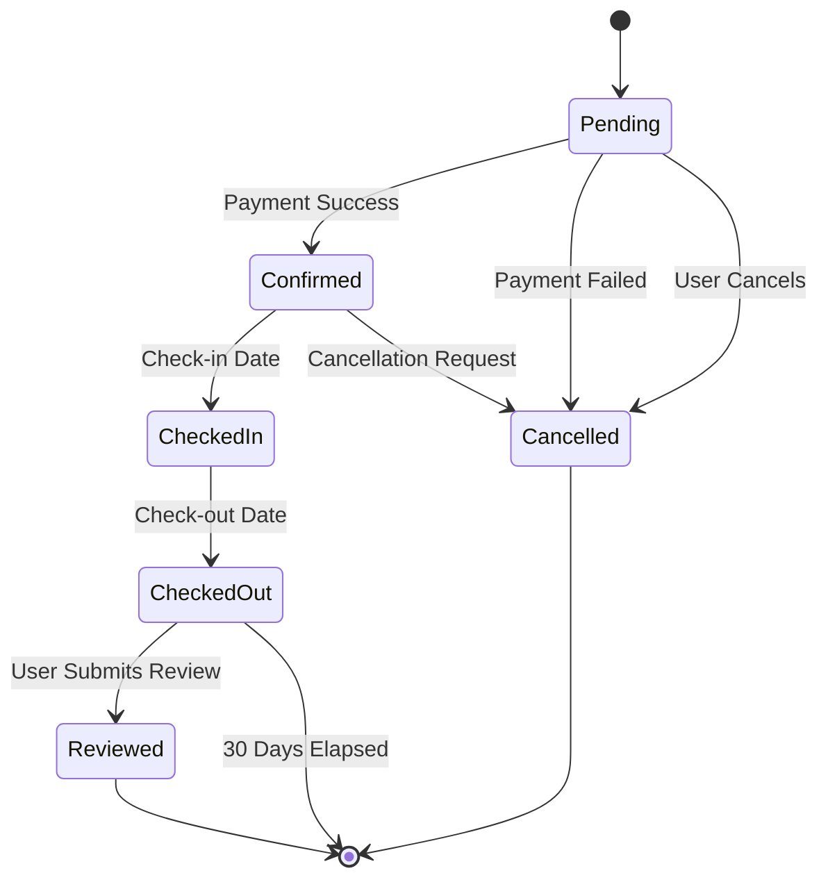

**Example - Booking Lifecycle:**

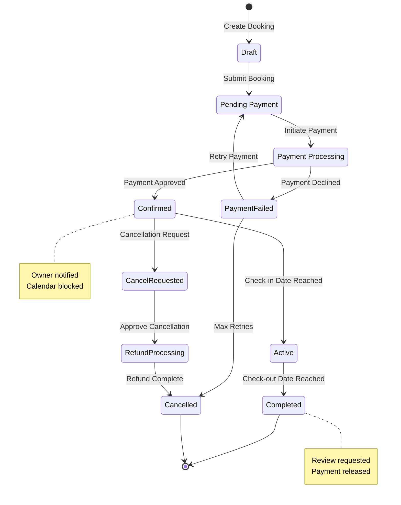

**Validation:**

- [ ] All states defined
- [ ] Transitions logical
- [ ] Start/end states marked
- [ ] Notes explain key states

**Output**: State diagram

### Step 7: Styling and Customization

**Objective**: Apply consistent styling to diagrams

**Theme Application:**

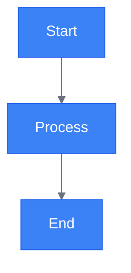

**Class Styling:**

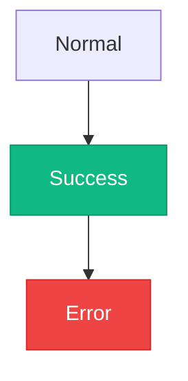

**Validation:**

- [ ] Colors match brand
- [ ] Contrast sufficient
- [ ] Styling consistent
- [ ] Readable in both themes

**Output**: Styled diagrams

## Output

**Produces:**

- Mermaid diagram code in markdown
- Multiple diagram types as needed
- Styled and themed diagrams
- Documentation-ready visualizations

**Success Criteria:**

- Diagram accurately represents system
- All elements properly labeled
- Relationships clear and correct
- Styling consistent with brand
- Renders correctly in markdown

## Best Practices

1. **Simplicity**: Keep diagrams focused and uncluttered
2. **Labels**: Clear, descriptive labels for all elements
3. **Direction**: Consistent flow direction (usually top-down or left-right)
4. **Grouping**: Use subgraphs to group related elements
5. **Colors**: Use color to highlight important elements
6. **Notes**: Add notes to explain complex logic
7. **Levels**: Use appropriate abstraction level for audience
8. **Updates**: Keep diagrams in sync with code
9. **Comments**: Add comments in mermaid code for maintainability
10. **Testing**: Verify diagrams render in target platform

## Common Patterns

### API Request Flow

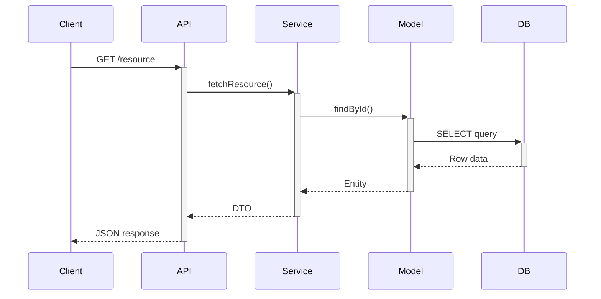

### Error Handling Flow

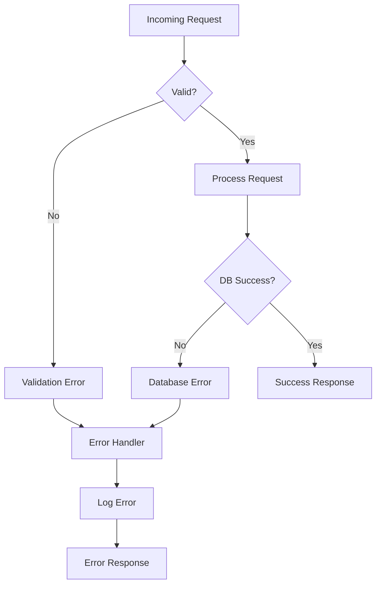

## Notes

- Mermaid renders in GitHub, GitLab, Notion, and most markdown viewers
- Live editor available at mermaid.live
- Maximum complexity: Keep under 20 nodes for readability
- Use subgraphs for grouping related nodes
- Test rendering in target platform before committing
- Keep diagram source in markdown files, not images
- Version control diagrams with code
- Update diagrams during code review

---
