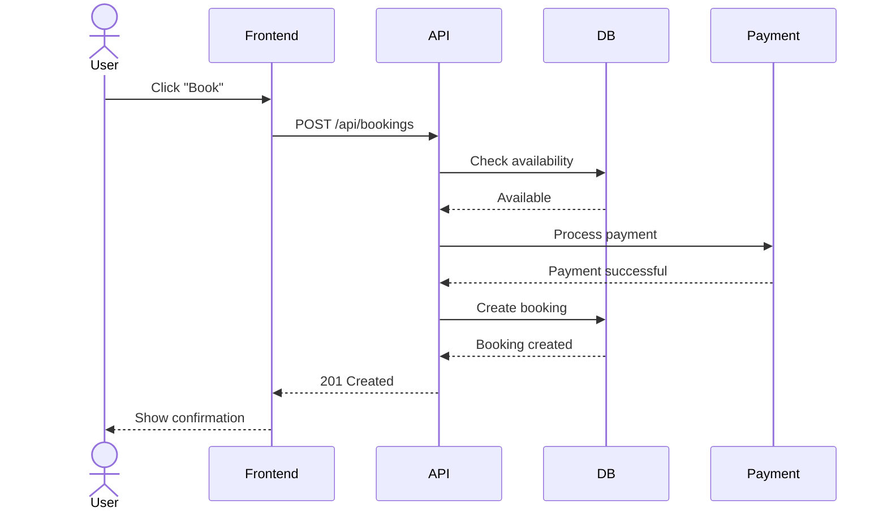
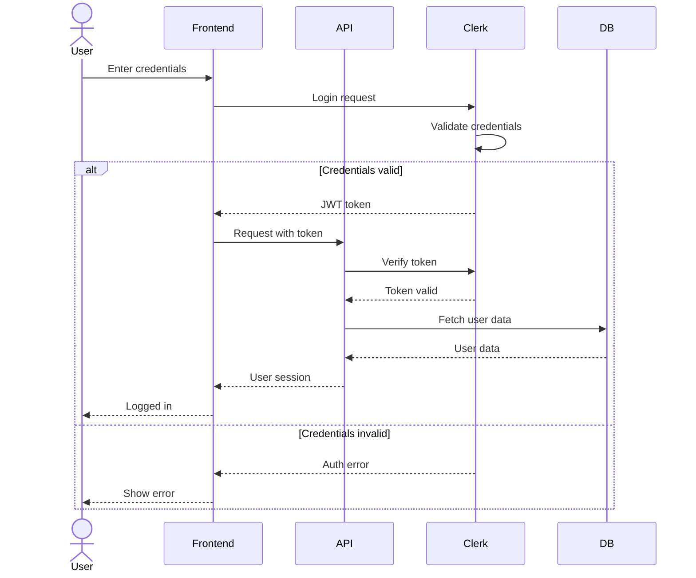

# Sequence Diagrams Reference

## Table of Contents
- [Overview](#overview)
- [Syntax Overview](#syntax-overview)
- [Participant Types](#participant-types)
- [Arrow Types](#arrow-types)
- [Example](#example)
- [Validation Checklist](#validation-checklist)

## Overview
Sequence diagrams describe interactions and message flows between actors and systems.

## Syntax Overview
Syntax:

## Participant Types
- `actor` - Human user
- `participant` - System/Service
- `database` - Database

## Arrow Types
- `->` - Solid line (synchronous)
- `-->` - Dotted line (response)
- `->>` - Solid arrow (async message)
- `-->>` - Dotted arrow (async response)

## Example - Authentication Flow:

## Validation Checklist
- [ ] All participants identified
- [ ] Message flow logical
- [ ] Return messages shown
- [ ] Alt/loop blocks used correctly
