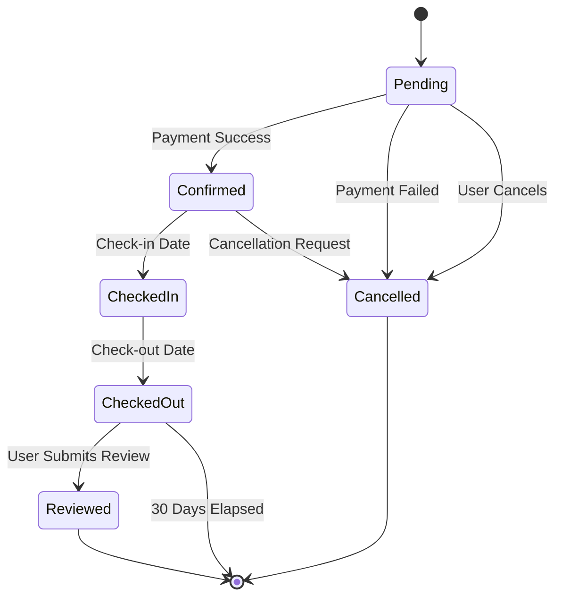
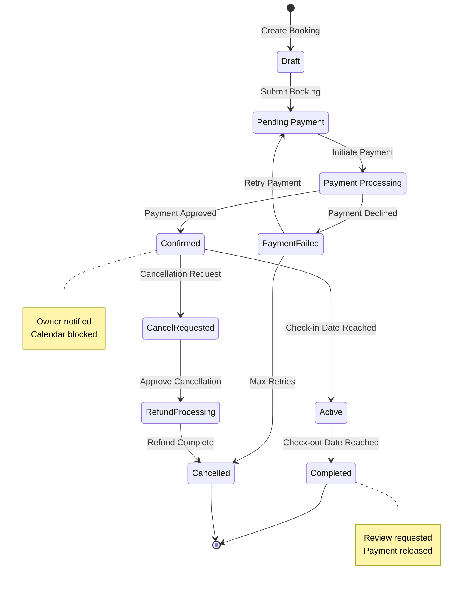

# State Diagrams Reference

## Table of Contents
- [Overview](#overview)
- [Syntax Overview](#syntax-overview)
- [Example](#example)
- [Validation Checklist](#validation-checklist)

## Overview
State diagrams describe the lifecycle and state transitions of an entity.

## Syntax Overview

## Example

## Validation Checklist
- [ ] All states defined
- [ ] Transitions logical
- [ ] Start/end states marked
- [ ] Notes explain key states
